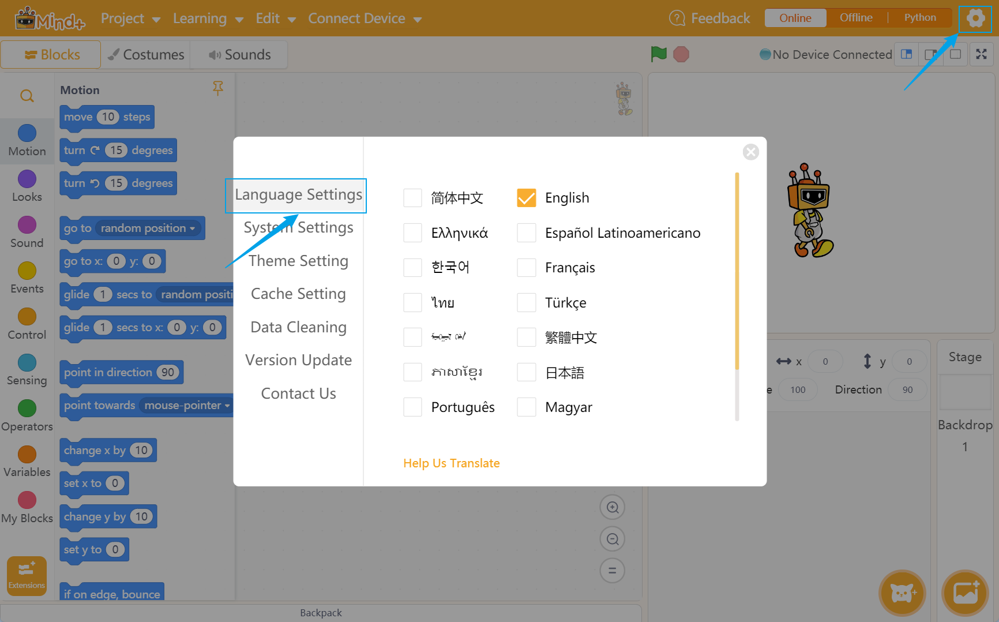
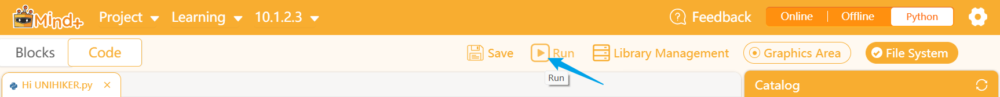
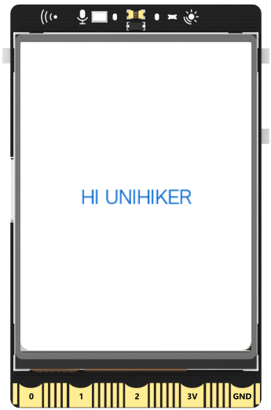

## **Download and Install the Mindplus (Mind+)**
In this tutorial, we will guide you through the process of downloading and installing Mindplus on your Windows, MacOS or Linux.

### **Mindplus (Mind+)**
Mind+ is a software designed for teenagers that supports AI and IoT functions by integrating with popular mainboards and open-source hardware. It offers an easy programming experience through graphical building blocks and advanced languages like Python, C, and C++.
### **Download the Editor**
Download the Mind+ application that supports UNIHIKER **(V1.7.2 RC3.0 or above)**. [[Download Mind+ from the official website]](https://mindplus.cc/download-en.html)


### **Installation and open Mind+**
After downloading the software, install it normally by clicking "Next". After the installation is complete, launch MindPlus, click on the "Gear" button in the top right corner of the software to select the language.
#### Windows 

#### Mac OS X

#### Linux

## **Starting up the UNIHIKER**
### **Connect the UNIHIKER**
To begin, connect the UNIHIKER to your computer using the Type-C to USB cable. Once connected and powered on, the UNIHIKER logo will appear on the screen.
{width=800, style="display:block;margin: 0 auto"}   

!!! note 
    For best results, please make sure to plug the USB cable directly into your computer's USB port without using an extension cord or dock. If you encounter any connection issues, please refer to the FAQ section for possible solutions.

## **Run a simple example with Python code**
Mind+ software offers programming support through Python code and provides a user-friendly graphical interface for programming the UNIHIKER. To access the graphical programming interface, simply click here to launch the Mind+ software on your computer.  

(1) To switch to code programming mode in the Mind+ software, click on the "Python" button in the upper right corner. This will allow you to write and execute Python code for your UNIHIKER.  

  

(2) Once you have completed the previous step, you will see a screen like this. The right side is the file directory, where you can access and organize your saved projects. The left side consists of the code editing area, where you can write and edit your Python code, and the terminal area, where you can view the output of your code.  

  

(3) To create a new file in your project, click on the "+" option in the right catalog and select "File". Then, name the file "Hi UNIHIKER.py" and click "Create". This will create a new Python file in your project.  

  

(4) To begin programming in the "Hi UNIHIKER.py" file, double-click on it in the file directory. This will open it in the code editing area, where you can write your Python code.  

  

(5) Here is the code snippet to display "HI UNIHIKER" on the screen: print("HI UNIHIKER")
Copy and paste this into the code editing area of the "Hi UNIHIKER.py" file.  

```python
from unihiker import GUI
import time

gui = GUI()
#unihiker text
gui.draw_text(text="HI UNIHIKER",origin="center",x=120,y=160,color="#0066CC")

while True:
    time.sleep(1)
```
(6) To run your code on the UNIHIKER, you will first need to connect to it. Click on the icon preceding the Terminal, and select "Connect Remote Terminal" from the menu. This will establish a connection to a remote terminal on the UNIHIKER.  

  

To connect to the UNIHIKER, click on the IP address 10.1.2.3 in the remote terminal menu. This will establish a connection between your computer and the UNIHIKER.  

  

!!! tip 
    If you experience any connection issues, make sure that the USB cable is properly plugged in and try troubleshooting according to the solutions provided in the document. If the issue persists, please refer to the FAQ or contact our technical support team for further assistance.  

Once you have established a successful connection, the file directory will display the files on the UNIHIKER, the terminal will switch to the remote terminal of the board, and the library management will switch to the board's library management. This will allow you to write and run Python code on the board.  

  

To run your code on the UNIHIKER, click on the "Run" button in the toolbar. This will upload the code to the board and execute it, displaying the results on the board's screen.  

  

{width=300, style="display:block;margin: 0 auto"}    

!!! note 
    As mentioned, the code you write in the Mind+ software resides on your computer. When you save your project, all the Python code, image resources, and other files included in the project will be packaged into a .mp file. This allows you to easily transfer and share your projects with others.  

  


---  
**Congratulations, you have successfully implemented programming control for the UNIHIKER. Now, you can explore exciting projects or understanding deeper of UNIHIKER.The possibilities are endless with UNIHIKER. Have fun exploring and learning!**  

**1. Discover more programming exercises: [Examples](../Examples/PythonCodingExamples/index.md)**  
**2. Explore Python libraries related to UNIHIKER: [Reference](../LanguageReference/UNIHIKER_Library/index.md)**  
**3. Gain insights into the built-in hardware of UNIHIKER: [Hardware ](../HardwareReference/hardware_reference_introduction.md)**    

---  


## **Run a simple example with Graphical Python**
(1) Click "Python" in the upper right corner.  

  

(2) To select the programming mode, click on the "Blocks" or "Code" button on the top left corner of the Mind+ software. For this project, we will choose "Blocks" as our programming mode. This will allow us to complete our  project using graphical building blocks.  

  

(3) Once the programming mode is selected, you will be taken to the main programming interface in Mind+. From here, you can begin your project using the selected mode.  

  

(4) To access "Expansions" in the Mind+ software, simply click on the button with the same name. This will allow you to explore and add different expansions or modules to your project.  

  

(5) Locate the "UNIHIKER" module under the "Official Library" and click to add it.  

  

(6) Then go back, and you can see UNIHIKER in "Command Area", which means UNIHIKER is done loading.  

  

  

(7) Please note that after the "UNIHIKER" module is loaded, an additional option will appear in the menu bar for connecting to UNIHIKER, labeled "Connect Remote Terminal". Select 10.1.2.3 to connect to UNIHIKER.  

  

!!! tips 
    If you encounter any connection issues, please ensure that the USB cable is correctly plugged in and refer to the troubleshooting section of this document for common solutions to the "unable to connect" problem.  

(8) Within the "UNIHIKER" Blocks library, locate the instruction for displaying text on the screen and drag it into the script area.  

  

(9) Gently place the instruction beneath the "Python main program start" section, seamlessly connecting it below like a puzzle piece.  

  

Example:
{width=600, style="display:block;margin: 0 auto"}  

(10) Upon clicking the "Run" button, the screen will promptly display the text "UNIHIKER".  

  
{width=300, style="display:block;margin: 0 auto"}  
  
---  
**Congratulations, you have successfully implemented programming control for the UNIHIKER. Now, you can explore exciting projects or understanding deeper of UNIHIKER.The possibilities are endless with UNIHIKER. Have fun exploring and learning!**  

**1. Discover more programming exercises: [Examples](../Examples/PythonCodingExamples/index.md)**  
**2. Explore Python libraries related to UNIHIKER: [Reference](../LanguageReference/UNIHIKER_Library/index.md)**  
**3. Gain insights into the built-in hardware of UNIHIKER: [Hardware ](../HardwareReference/hardware_reference_introduction.md)**    

---  
