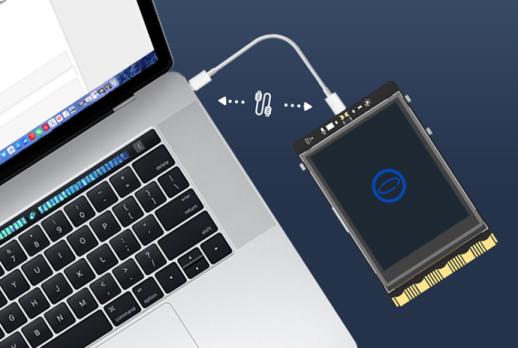

## **Download and Install the Python IDLE**
In this tutorial, we will demonstrate how to download and install Python IDLE on your Windows, Mac, or Linux computer.  
### **Python IDLE**
Python IDLE is the official integrated development environment (IDE) for Python, offering an interactive interpreter and a multi-window text editor for writing and executing Python code. It supports features like code highlighting, automatic indentation, intelligent completion, and debugging tools, making it well-suited for Python beginners.  
{width=200, style="display:block;margin: 0 auto"}
### **Requirements**
Python IDLE, an integrated editor bundled with Python, provides cross-platform compatibility across Windows, Linux, and macOS systems. Once Python is installed, IDLE becomes readily accessible. Python itself has modest hardware requirements, and its compatibility with various operating systems influences system costs based on the specific version in use.  

- For Windows, Python 3.8 and above supports Windows 7 and higher. Python 3.9 and above requires Windows 8.1 or higher.  
- For Linux, Python 3.9 and later versions have ceased support for 32-bit Linux systems, including popular distributions like Ubuntu. Therefore, if you intend to install Python 3.9 or higher on Linux, your system must be 64-bit.  
- For macOS, Python 3.9 and later versions support macOS 10.9 (Mavericks) and above.  
### **Download**
Python IDLE is automatically installed along with Python, so we just need to download and install Python.[ [Download from the official website]](https://www.python.org/downloads/)

### **Installation and open Python IDLE**
#### Windows 

#### macOS

#### Linux

## **Starting up the UNIHIKER**
### **Connect the UNIHIKER**
Connect the UNIHIKER to your computer using the Type-C to USB cable. Once connected and powered on, the UNIHIKER logo will appear on the screen.
{style="display:block;margin: 0 auto"}
!!! note ""
    Note1: Please ensure that you plug the USB cable directly into the computer's USB port without using an extension cord or dock. If you encounter any connection issues, please refer to the FAQ for a solution.  
    Note2: When the UNIHIKER is connected to your PC via USB, the IP address is fixed at 10.1.2.3. You can find the IP address in the "Home" menu of the UNIHIKER.  
## **Run a simple example with Python IDLE**
The Python IDLE software supports programming through Python code, you can create a simple example as follows.
(1) Launch the Python IDLE software, and you will see a screen like this. At the top is the menu bar, and below is the terminal window.  
{width=500, style="display:block;margin: 0 auto"}  
  
(2) Click on the 'File' button located at the upper left corner, then select 'New File' to create a new file.  
{width=500, style="display:block;margin: 0 auto"}  
  
(3) After completing the previous step, you will see a screen like this. You can write your code within the code editing area.  
{width=500, style="display:block;margin: 0 auto"}  
  
(4) After creating the file, you can follow the steps below to save it to UNIHIKER:  
① Click on the 'Save As' button.
{width=500, style="display:block;margin: 0 auto"}  
  
② Input ```\\10.1.2.3\``` and enter the file directory of UNIHIKER.
{width=500, style="display:block;margin: 0 auto"}  
  
③ Double-click the 'root' button .
> Note1: If prompted to enter the access account and password, simply input 'root' as the account and 'dfrobot' as the password.   
> Note2: "Root" refers to the onboard memory space, while "media" refers to the external storage space. When an SD card or USB drive is connected, it automatically mounts to this directory.  
{width=500, style="display:block;margin: 0 auto"}  
  
④ Rename the file as 'Hi UNIHIKER.py' and save it .
{width=500, style="display:block;margin: 0 auto"}  
  
（5）After saving the file, we can insert this code into the code editing area of the file "Hi UNIHIKER.py", as shown below.
```python
from unihiker import GUI
import time

gui = GUI()
#unihiker text
gui.draw_text(text="HI UNIHIKER",origin="center",x=120,y=160,color="#0066CC")

while True:
    time.sleep(1)
```
{width=500, style="display:block;margin: 0 auto"}  
  
(6) Running the program on the UNIHIKER.
We have composed the program within the file directory of UNIHIKER. Now, we can execute this program and observe the resulting effects by following the subsequent steps.  
{width=700, style="display:block;margin: 0 auto"}  
  
When we run the program, the words 'HI UNIHIKER' will display on the screen.   

{width=300, style="display:block;margin: 0 auto"}  
  
!!! Note     
    We use Python IDLE as a code editor to compose Python programs in this sample. Moreover, we have the flexibility to use various other editors to realise programs, such as Notepad.   
  
  
---  
**Congratulations, you have successfully implemented programming control for the UNIHIKER. Now, you can explore exciting projects or understanding deeper of UNIHIKER.The possibilities are endless with UNIHIKER. Have fun exploring and learning!**  

**1. Discover more programming exercises: [Examples](../Examples/PythonCodingExamples/index.md)**  
**2. Explore Python libraries related to UNIHIKER: [Reference](../LanguageReference/UNIHIKER_Library/index.md)**  
**3. Gain insights into the built-in hardware of UNIHIKER: [Hardware ](../HardwareReference/hardware_reference_introduction.md)**    

---  