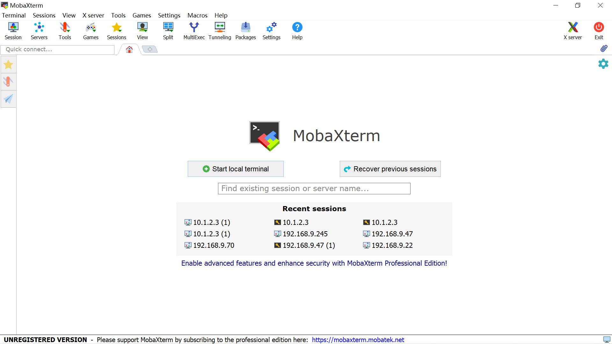
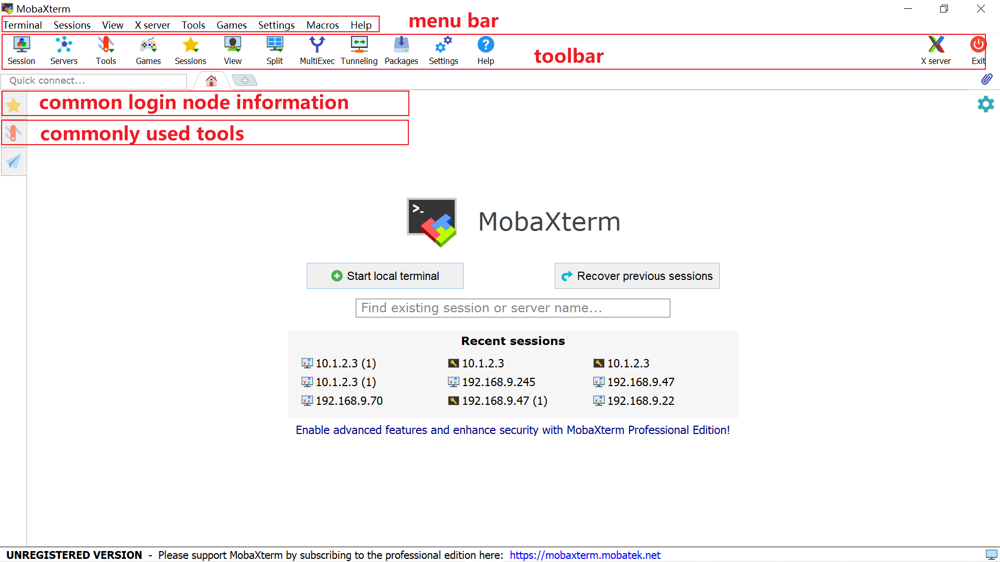
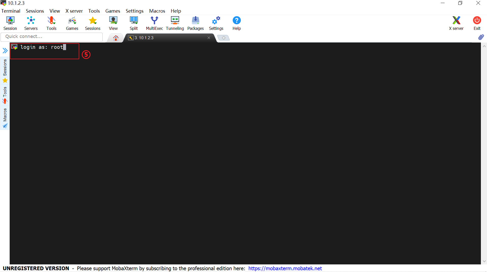

SSH is a method for remotely connecting to UNIHIKER, allowing us to write programs for UNIHIKER in this way. There are various SSH tools available for different systems:

!!! note 
    The SSH service is enabled by default on UNIHIKER. The details are as follows: 
    SSH Port: 22  
    Account: root  
    Password: dfrobot  


- On Windows systems, PuTTY or the more comprehensive MobaXterm is recommended.
- On Linux systems, PuTTY or terminal tools are typically used.
- On macOS systems, PuTTY or terminal tools can also be used.


## **PuTTY -- For Linux & MacOS & Windows**
### **Downloading and Installing the PuTTY**
In this tutorial, we will demonstrate how to download and install PuTTY on your computer.  

#### PuTTY
PuTTY is an open-source, free network remote login tool that can be used on Windows and Unix-like systems such as Linux and macOS. It supports multiple network protocols such as SSH, Telnet, Rlogin, etc., enabling secure remote login to servers for command-line operations or file transfers. Additionally, PuTTY also supports advanced features like serial port connections and X11 forwarding.
#### Download and Install the Software
- Linux -  Open a terminal, then enter ```sudo apt-get install putty``` to install the Putty software.  
- Windows - After downloading the appropriate Windows Installer software for your system from [the official PuTTY website](https://www.chiark.greenend.org.uk/~sgtatham/putty/latest.html), you can install it directly.
- MacOS X - Open a terminal, then enter ```brew install putty``` to install the Putty software.  

### **Starting up the UNIHIKER**
#### Connect the UNIHIKER
Connect the UNIHIKER to your computer using the Type-C to USB cable. Once connected and powered on, the UNIHIKER logo will appear on the screen.  
{width=500, style="display:block;margin: 0 auto"}  
!!! note
    1. Please ensure that you plug the USB cable directly into the computer's USB port without using an extension cord or dock. If you experience any issues with the connection, please refer to the FAQ for a solution. 
    2. When the UNIHIKER is connected to your PC via USB, the IP address is fixed at 10.1.2.3. You can find the IP address in the "Home" menu of the UNIHIKER.  

### **Run a simple example with PuTTY SSH**
The PuTTY software supports programming the UNIHIKER through Python code, you can create a simple example as follows.  

(1) Collect UNIHIKER 
You can open a terminal and enter `putty -ssh root@10.1.2.3`, then input 'dfrobot' as the password in the new interface to establish an SSH connection to UNIHIKER.  

  
!!! note 
    1. When connecting UNIHIKER to the computer via a USB cable, the default IP address is '10.1.2.3', the default username is 'root', and the default password is 'dfrobot'.  
    2. If it prompts "Can't connect to '10.1.2.3' with user 'root': [WinError 10060]", you should verify whether the board is properly connected to the computer.    
  
Upon successful connection, you can enter 'ls' to list the files within the board.  

  
  
(2)  Create Python file
You may enter ```touch Hi_UNIHIKER.py``` to create a new file named "Hi_UNIHIKER.py" .

(3) Program the Python file 
After creating the file, you may first enter ```vim Hi_UNIHIKER.py``` to open the file "Hi_UNIHIKER.py" ,and then enter ```i```. You can insert this code into the code editing area. Here's a code snippet that will display "HI UNIHIKER" on the screen.And after finishing the porgramming,you can press "ESC" and enter ```:wq!``` so that you can save and exit.
```python
from unihiker import GUI
import time

gui = GUI()
#unihiker text
gui.draw_text(text="HI UNIHIKER",origin="center",x=120,y=160,color="#0066CC")

while True:
    time.sleep(1)
```  
   
(4) Run the program on the UNIHIKER.
Input ```python Hi_UNIHIKER.py``` in the terminal and press enter so that you can run the program.  
{width=300, style="display:block;margin: 0 auto"}  

!!! note
    Note: Press Ctrl+C can stop the program.  
  
---  
**Congratulations, you have successfully implemented programming control for the UNIHIKER. Now, you can explore exciting projects or understanding deeper of UNIHIKER.The possibilities are endless with UNIHIKER. Have fun exploring and learning!**  

**1. Discover more programming exercises: [Examples](../Examples/PythonCodingExamples/index.md)**  
**2. Explore Python libraries related to UNIHIKER: [Reference](../LanguageReference/UNIHIKER_Library/index.md)**  
**3. Gain insights into the built-in hardware of UNIHIKER: [Hardware ](../HardwareReference/hardware_reference_introduction.md)**    

---  


## **MobaXterm -- For Windows**
### **Downloading and Installing the MobaXterm**
In this tutorial, we will demonstrate how to download and install MobaXterm on your Windows computer.  

#### MobaXterm [Xserver SSH](https://mobaxterm.mobatek.net/download.html)
MobaXterm is a comprehensive terminal emulator for Windows, offering integrated SSH, Xserver, and other network tools. MobaXterm Xserver SSH combines MobaXterm's Xserver and SSH features, allowing users to manage remote servers, execute local and remote commands, and run Python scripts from Unix/Linux servers in a Windows environment.

#### Download the Software
Download the MobaXterm application.[[Download MobaXterm from the official website]](https://mobaxterm.mobatek.net/download.html)  


#### Installation and open MobaXterm

Install MobaXterm on your computer.



### **Starting up the UNIHIKER**
#### Connect the UNIHIKER
Connect the UNIHIKER to your computer using the Type-C to USB cable. Once connected and powered on, the UNIHIKER logo will appear on the screen.  
{width=800, style="display:block;margin: 0 auto"}  
  
!!! note
    1. Please ensure that you plug the USB cable directly into the computer's USB port without using an extension cord or dock. If you encounter any issues with the connection, please refer to the FAQ for a solution.  
    2. When the UNIHIKER is connected to your PC via USB, the IP address is fixed at 10.1.2.3. You can find the IP address in the "Home" menu of the UNIHIKER.  
### **Run a simple example with MobaXterm Xserver SSH**
The MobaXterm software supports programming the UNIHIKER through Python code, you can create a simple example as follows.  
(1) Launch MobaXterm, and you will see a screen like this. The left side consists of commonly used tools and node information, while the menu bar and toolbar occupy the uppermost position of the interface.  

  
  
(2) To connect to UNIHIKER using MobaXterm, follow these steps:

1. Click on the "Session" option to open a new window.
2. Select "SSH".
3. Input the remote host (IP) of the board.
4. Click "OK" in the new window to initiate the SSH session.

  
  
After that, it will prompt for the account to login. Enter 'root' as the username. If prompted for a password, enter 'dfrobot'.  

!!! note
    1. When connecting UNIHIKER to the computer via a USB cable, the default IP address is '10.1.2.3', the default username is 'root', and the default password is 'dfrobot'.  
    2. If it prompts "Can't connect to '10.1.2.3' with user 'root': [WinError 10060]", you should verify whether the board is properly connected to the computer.   
  
After successful connection, the file directory will display the files within the board, and the terminal will switch to the remote terminal of the board.  
  
  
(3)  Then, you may click "new" option to create a new file named "Hi_UNIHIKER.py" .  

  
  
(4) After creating the file, you may double-click the file "Hi_UNIHIKER.py" and insert this code into the code editing area. Here's a code snippet that will display "HI UNIHIKER" on the screen.  

  

```python
from unihiker import GUI
import time

gui = GUI()
#unihiker text
gui.draw_text(text="HI UNIHIKER",origin="center",x=120,y=160,color="#0066CC")

while True:
    time.sleep(1)
```
Then, close and **save** the file.
{style="display:block;margin: 0 auto"}   
   
(5) Running the program on the UNIHIKER.
Input "python Hi_UNIHIKER.py" in the terminal and press enter so that you can run the program.  

  
  
After running the code, the board will execute it, and you can observe the running result directly on the board itself.  
{width=300, style="display:block;margin: 0 auto"}
  


---  
**Congratulations, you have successfully implemented programming control for the UNIHIKER. Now, you can explore exciting projects or understanding deeper of UNIHIKER.The possibilities are endless with UNIHIKER. Have fun exploring and learning!**  

**1. Discover more programming exercises: [Examples](../Examples/PythonCodingExamples/index.md)**  
**2. Explore Python libraries related to UNIHIKER: [Reference](../LanguageReference/UNIHIKER_Library/index.md)**  
**3. Gain insights into the built-in hardware of UNIHIKER: [Hardware ](../HardwareReference/hardware_reference_introduction.md)**    

---  


## **Terminal -- For MacOS**
The Terminal application on macOS comes with a built-in SSH client that can directly implement SSH remote connections. You just need to enter the following command in Terminal: ```ssh root@10.1.2.3```. This command will initiate an SSH connection to UNIHIKER using the default IP address and username.  
