## **Download and Install the VSCode**
In this tutorial, we will demonstrate how to download and install VSCode (Visual Studio Code) on your Windows, Mac, or Linux computer.   

### **VSCode** 
VSCode is an elegant, free, and open-source code editor developed by Microsoft. It serves as a cross-platform solution, supporting numerous programming languages such as Python and C++. With features including syntax highlighting, code completion, and error detection, it empowers developers with a robust set of tools. Furthermore, its extension plugin system allows for customization and enhanced functionality, catering to diverse development requirements.   

### **Download the Editor**
[[Download the VSCode]](https://code.visualstudio.com/download) .   

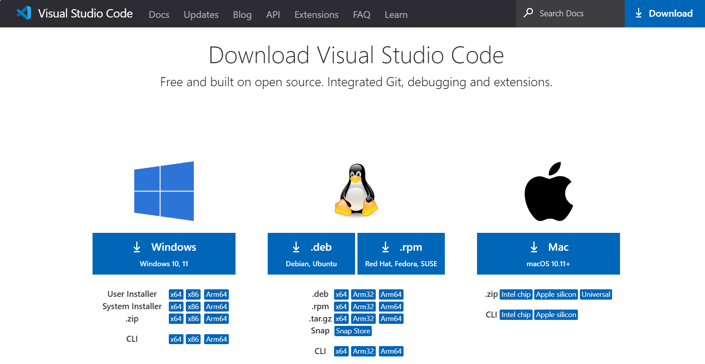  

### **Installation and Open VSCode**
#### Windows 
Install VSCode on your computer.

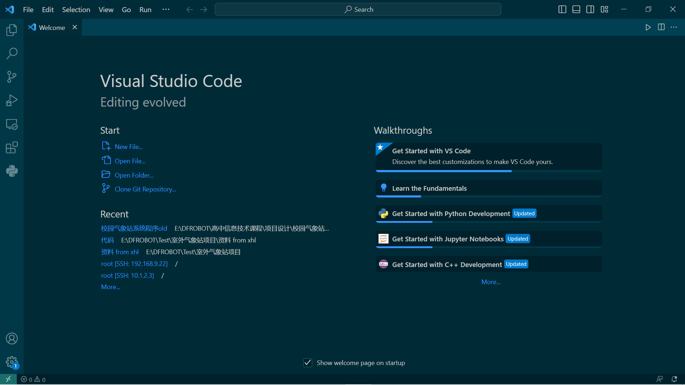  

#### macOS
Install VSCode on your computer.

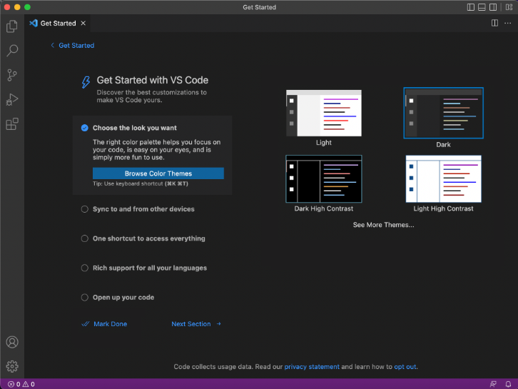  

#### Linux
Install VSCode on your computer.

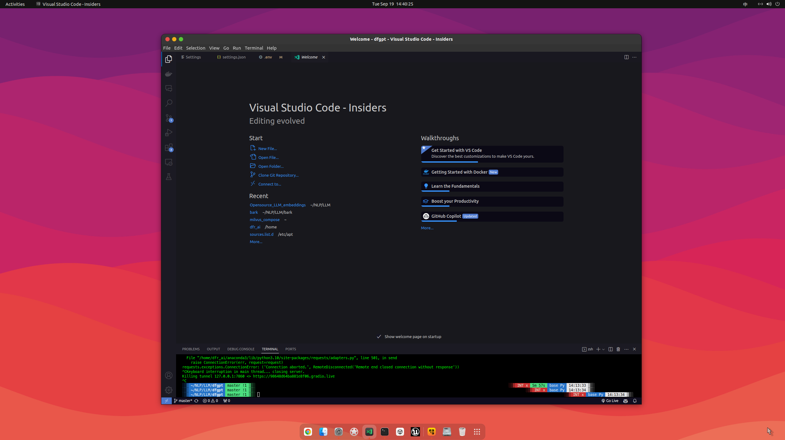  

## **Starting up the UNIHIKER**
### **Connect the UNIHIKER**
Connect the UNIHIKER to your computer using the Type-C to USB cable. Once connected and powered on, the UNIHIKER logo will appear on the screen.   
   

!!! note
    1. Please ensure that you plug the USB cable directly into the computer's USB port without using an extension cord or dock. If you experience any issues with the connection, refer to the FAQ for a solution.  
    2. When the UNIHIKER is connected to your PC via USB, the IP address is fixed at 10.1.2.3. You can find the IP address in the "Home" menu of the UNIHIKER.    

## **Run a simple example with VSCode**
The VSCode software supports programming the UNIHIKER through Python code, you can create a simple example as follows.  

(1) Launch the VSCode software, and you will see a screen similar to this.   

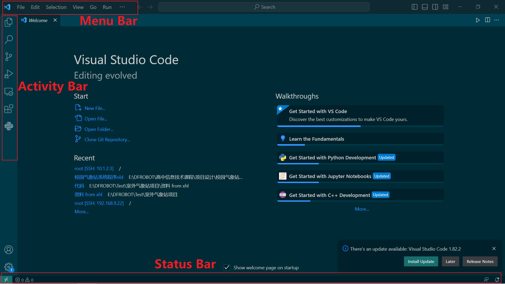  
  
(2) Install the "Python" extension from the VSCode Extensions marketplace.  

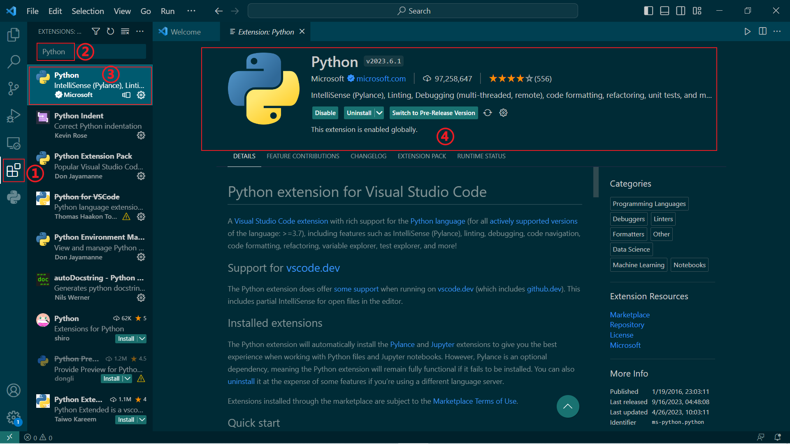  
  
(3) Search for the "remote" extension and install "Remote - SSH".  
SSH (Secure Shell) is a network protocol that enables secure remote access and data transfer between computers over unsecured networks. It establishes an encrypted channel to ensure the security and integrity of the data transmitted.  
The UNIHIKER has SSH service enabled by default, allowing you to use SSH tools such as PuTTY, MobaXterm, or Remote-SSH in VSCode to connect to it from another computer.  

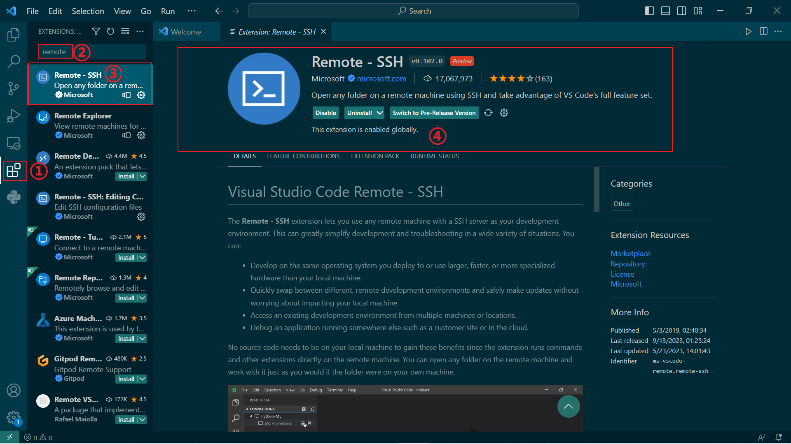  
  
(4) Once the installation is complete, you will find the Remote Explorer in VSCode. To add a new connection, enter the SSH account as "root" and the password as "dfrobot". When connected via USB, the IP address is fixed as "10.1.2.3". Therefore, enter "root@10.1.2.3" and select "Linux". Enter the password when prompted.  

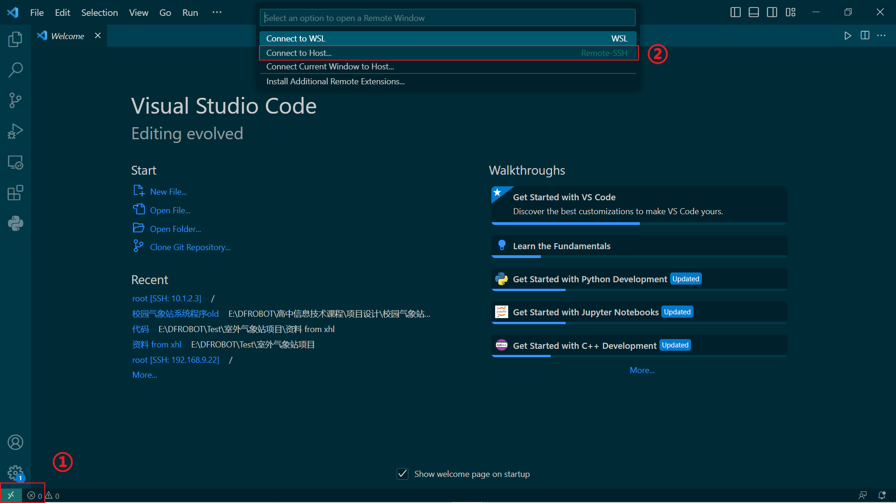  

Input 'root@10.1.2.3' as host.  

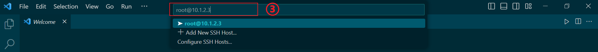  

Select 'Linux' from the newly appeared pop-up window.    

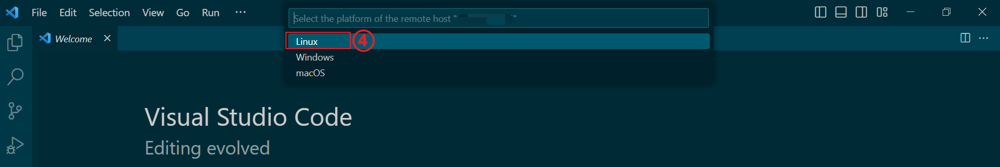  

Input the password 'dfrobot' and press Enter.    

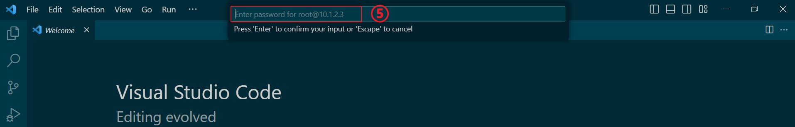  

Note: If the connection fails, please retry multiple times.   
After successful connection, the status bar will display as follows.  

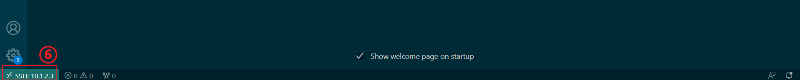  

Note: If you encounter any connection issues, please ensure that the USB cable is correctly plugged in.  


  
(5)  Once connected, you can select the UNIHIKER directory to open files and write programs for execution later.   

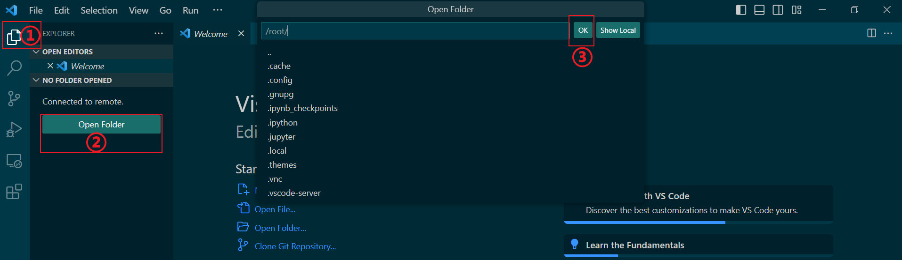  

Input the password 'dfrobot' and press Enter.  

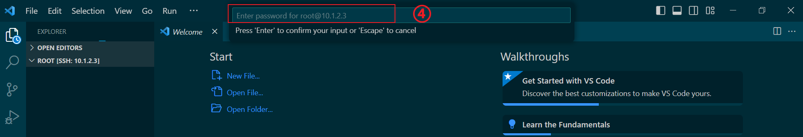  

After completing the previous step, you will see a screen like this. The first part corresponds to the sidebar, which serves as the file directory area of the board. The second part is the Panel Bar, which includes sections for problems, output, terminal, debug console, and ports.   

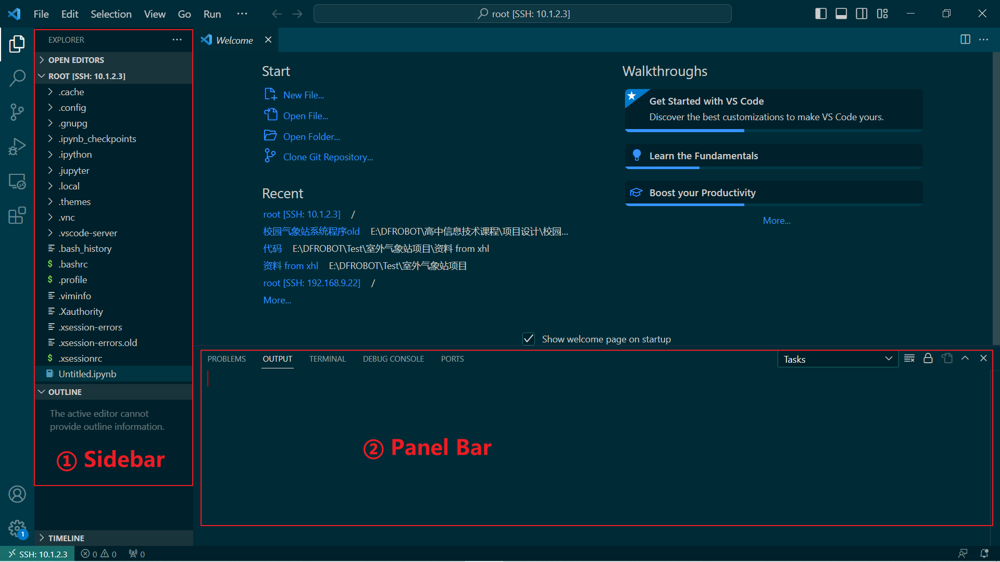
  
(6) Then, we can click "+" option here to create a new file named "Hi_UNIHIKER.py" .  

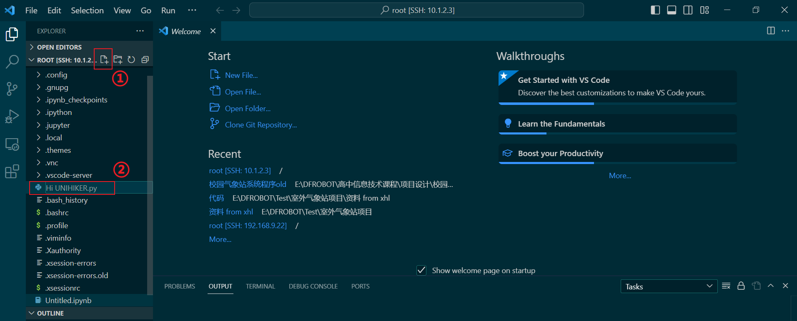  
  
(7) After creating the file, we can double-click on the "Hi_UNIHIKER.py" file to program it in the code editing area of the program, as shown below.  

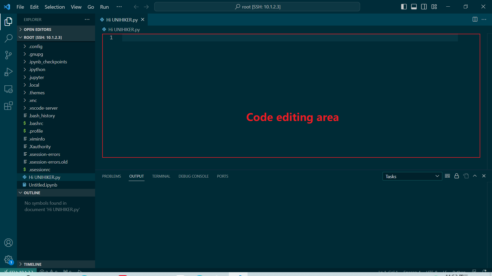  
  
（8）Please insert this code into the code editing area of the file "Hi_UNIHIKER.py". Here's a code snippet that will display "HI UNIHIKER" on the screen.  


```python
from unihiker import GUI
import time

gui = GUI()
#unihiker text
gui.draw_text(text="HI UNIHIKER",origin="center",x=120,y=160,color="#0066CC")

while True:
    time.sleep(1)
```
  
（9）Run the program on the UNIHIKER.
Right-click on the 'Hi_UNIHIKER.py' file, choose 'Open in Integrated Terminal', then input 'python Hi_UNIHIKER.py' and press Enter.   

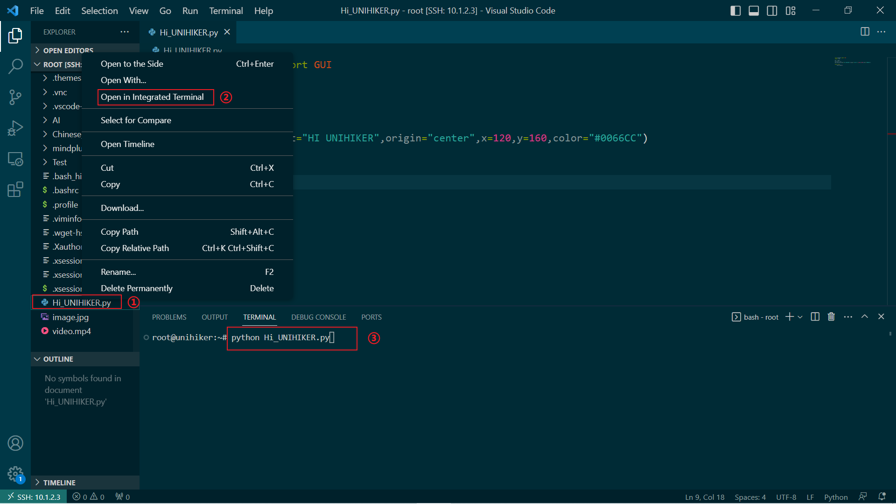  

After running the code, the result will demonstrate on the screen.   


  
---  
**Congratulations, you have successfully implemented programming control for the UNIHIKER. Now, you can explore exciting projects or understanding deeper of UNIHIKER.The possibilities are endless with UNIHIKER. Have fun exploring and learning!**  

**1. Discover more programming exercises: [Examples](../Examples/PythonCodingExamples/index.md)**  
**2. Explore Python libraries related to UNIHIKER: [Reference](../LanguageReference/UNIHIKER_Library/index.md)**  
**3. Gain insights into the built-in hardware of UNIHIKER: [Hardware ](../HardwareReference/hardware_reference_introduction.md)**    

---  
