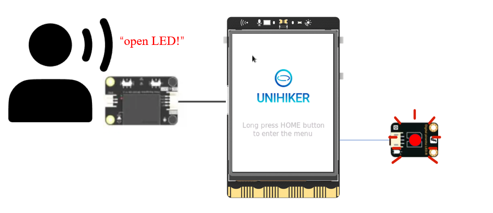
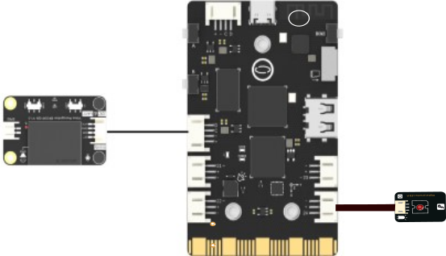

## **Project Introduction**
In this chapter, we have implemented an AI Voice-Controlled Lights by using external voice recognition module and an LED light.  

To control an external voice recognition module using the UNIHIKER, we can use DFRobot_DF2301Q_I2C(). This will allow us to access and control the audio through the side interface of the board, which is connected to a microcontroller responsible for controlling onboard components and GPIO. Similar to the usage of LED in the first section 'Blinking LED' of the intermediate class in the previous chapter, we also need to initialize the external LED. 

To control the response made by the speech recognition module after recognizing the sentence, we can use the get_CMDID() methods from the DFRobot_DF2301Q library in Python. This will allow us to Control the state of the LED according to the user's voice through voice recognition module. You can explore different functionalities and parameters to customize your DIY AI Voice-Controlled Lights.

## **Hardware Required**

- [UNIHIKER](https://www.dfrobot.com/product-2691.html)
- [Gravity: Offline Language Learning Voice Recognition Sensor for micro:bit / Arduino / ESP32 - I2C & UART](https://www.dfrobot.com/product-2665.html)
- [Gravity: Digital Piranha LED Module - Red](https://www.dfrobot.com/product-471.html)

{width=600, style="display:block;margin: 0 auto"}  

**Code**  

To create a DIY AI Voice-Controlled Lights, we can use the DFRobot_DF2301Q library in Python. 

- Import DFRobot_DF2301Q  and use DF2301Q = DFRobot_DF2301Q_I2C() to initialize the voice recognition module output function. 
- Use DF2301Q.set_volume(5) to set the volume audio output. We can use led.value(1) to control the state of the LED. Two discriminative statements are used here to recognize the recorded voice ID passed in by the voice module.   
- You can experiment with different parameters and functions to customize your DIY AI Voice-Controlled Lights project further.  
```python
#  -*- coding: UTF-8 -*-
from pinpong.board import Board,Pin
import time
#Download the DFRobot_DF2301Q.py library file suitable for UNIHIKER from this link and place it in the same folder as this program.
#https://github.com/DFRobot/DFRobot_DF2301Q/tree/master/python/unihiker
from DFRobot_DF2301Q import *

Board().begin()
led = Pin(Pin.P24, Pin.OUT)  # Pin initialization to level output
DF2301Q = DFRobot_DF2301Q_I2C()  # Initialize
DF2301Q.set_volume(5)  # Volume
DF2301Q.set_mute_mode(0)  # Set mute
DF2301Q.set_wake_time(20)  # Set wake time
print(DF2301Q.get_wake_time())
DF2301Q.play_by_CMDID(2)
print("----------------------")

while True:
    DF2301Q_CMDID = DF2301Q.get_CMDID()
    time.sleep(0.05)
    if (not DF2301Q_CMDID==0):
        if ((DF2301Q_CMDID) == 5):
            led.value(1)  # Output High Level
            print("1")  # Terminal printing information
        if ((DF2301Q_CMDID) == 6):
            led.value(0)  # Output low level
            print("0")  # Terminal printing information

```
## **Demo Effect**


---
