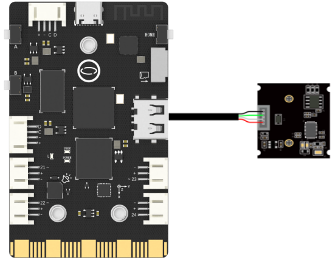
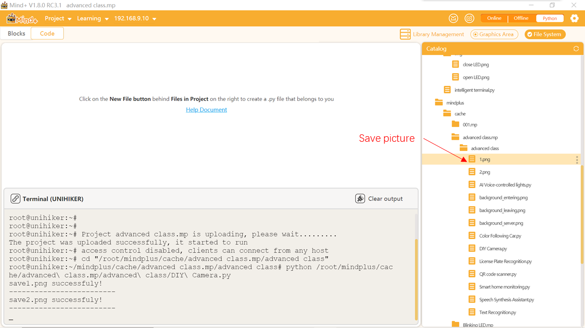

## **Project Introduction**
To create a DIY Camera, we will use a USB camera as an expansion module.   

To control a USB camera using the UNIHIKER, we can use the OpenCV library in Python. This will allow us to access and control the camera through the side interface of the board, which is connected to a microcontroller responsible for controlling onboard components and GPIO.  

To control the DIY Camera and shoot a video, we can use the cap.read() and cv2.imshow() methods from the OpenCV library in Python. This will allow us to read the video stream from the camera and display it on the UNIHIKER board's screen. You can explore different functionalities and parameters of the OpenCV library to customize your DIY Camera project.  

![20240801_220924[00h00m00s-00h00m05s].gif](img/3_DIY_Camera/1722521420753-7d7a14ba-7082-4e76-bd6d-8cf598b72dd4.gif){style="display:block;margin: 0 auto"}
## **Hardware Required**

- [UNIHIKER](https://www.dfrobot.com/product-2691.html)
- [MegaPixels USB Camera for Raspberry Pi / NVIDIA Jetson Nano / UNIHIKER](https://www.dfrobot.com/product-2089.html)

{width=400， style="display:block;margin: 0 auto"}
## **Code**
To implement video streaming and capturing with the DIY Camera project, we can use the OpenCV library in Python.  

- Import cv2 and use cap = cv2.VideoCapture(0) to initialize the camera's function for video output.   
- We can use cap.set(), cv2.namedWindow(), and cv2.setWindowProperty() to set the frame rate, window initialization, and window size of the video stream.  
- In the main loop, we can use the ret, frame = cap.read() method to initialize the video stream parameters. Then, we can use if statements to check if a certain key has been pressed, and use cv2.imwrite() to capture and save the current frame when the key 'a' is pressed.   
- Press the 'b' key and use the function cap.release() to close the camera. 
- Feel free to explore and experiment with a variety of parameters and features to personalize your DIY camera project according to your specific needs and preferences.


```python
#  -*- coding: UTF-8 -*-
import cv2  # Import OpenCV library


# Open usb camera 0. -1 indicates automatic recognition.
cap = cv2.VideoCapture(0) 
# Set the camera buffer to 1, to decrease the latency.
cap.set(cv2.CAP_PROP_BUFFERSIZE, 1) 
# Set the windows to be full screen.
cv2.namedWindow('winname',cv2.WND_PROP_FULLSCREEN) 
# Set the windows to be full screen.
cv2.setWindowProperty('winname',cv2.WND_PROP_FULLSCREEN, cv2.WINDOW_FULLSCREEN) 

index = 1

while (cap.isOpened()): 
    # Read one frame from usbcam.
    ret, frame = cap.read() 
    # If frame available. 
    if ret: 
        '''crop the center of the frame and resize to (240, 320) while keeping image ratio.'''
        h, w, c = frame.shape  # Record the shape and size of the image, including height, width, and channel
        w1 = h*240//320  # change the height to fit the render image
        x1 = (w-w1)//2  # midpoint of width without resizing
        frame = frame[:, x1:x1+w1]  # crop into the center
        frame = cv2.resize(frame, (240, 320))  # resize according to the screen keeping the aspect ratio 
        '''Display real-time video stream'''
        cv2.imshow('winname',frame)  # Display image img on winname window
        key = cv2.waitKey(10)  #Detect whether the 10ms key is pressed.if imshow is used in a loop, waitKey must be used to avoid the window from freezing.
        if key & 0xFF == ord('a'):  # Press the A key to enter the save image operation below
            cv2.imwrite(str(index) + ".png", frame)
            print("save" + str(index) + ".png successfuly!")
            print("-------------------------")
            index += 1
        '''Press the B key to exit the program'''
        if key & 0xFF == ord('b'):
            break

cap.release()  # Release the camera
cv2.destroyAllWindows()  # Close all

```
## **Demo Effect**
![20240801_220924[00h00m00s-00h00m05s].gif](img/3_DIY_Camera/1722521436349-7e4260b8-3ff5-43c5-8c04-1d392b32c81d.gif){style="display:block;margin: 0 auto"}



---
