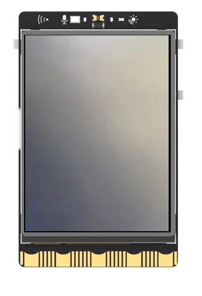
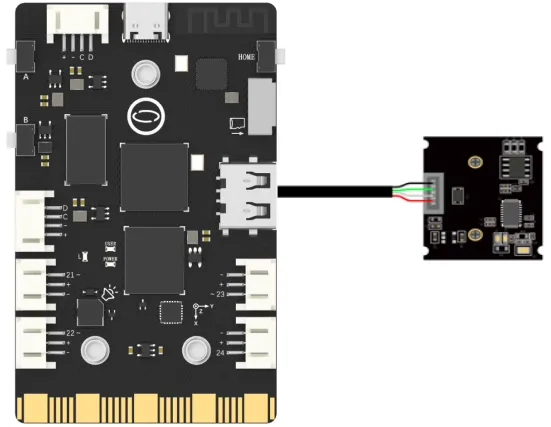

## **Project Introduction**
To create a Smart Home Monitor, we will utilize a USB camera as an expansion module.

To control the USB camera using UNIHIKER, we can utilize the OpenCV library. This method allows us to access and control the camera through the board's side interface, which is connected to a microcontroller responsible for managing onboard components and GPIO.

For Camera-based facial detection, we can employ the getAndRenderFace(img) function from the Python OpenCV library. This function enables us to detect faces from the camera feed and display them on the screen of the UNIHIKER board. Feel free to explore the various functionalities and parameters of the OpenCV library to customize your Smart Home Monitoring system.

{width=270} 
![20240801_220338[00h00m00s-00h00m03s].gif](img/4_Smart_Home_Monitoring/1722521084228-fc6d5492-c0d8-4b26-9d47-1e5f1a9820f1.gif)  

## **Hardware Required**

- [UNIHIKER](https://www.dfrobot.com/product-2691.html)
- [MegaPixels USB Camera for Raspberry Pi / NVIDIA Jetson Nano / UNIHIKER](https://www.dfrobot.com/product-2089.html)

{width=400， style="display:block;margin: 0 auto"}  

## **Code**
To implement video streaming and capturing with the Smart Home Monitoring project, we can use the OpenCV library in Python.   

First, import cv2 and use cap = cv2.VideoCapture(0) to initialize the camera's function for video output. At the same time, because we are using an onboard buzzer, we need to use the function Board("UNIHIKER").begin() to initialize UNIHIKER. Then, we can use cap.set(), cv2.namedWindow(), and cv2.setWindowProperty() to set the frame rate, window initialization, and window size of the video stream.   

In the main loop, we can use the ret, frame = cap.read() method to initialize the video stream parameters. We set up a callback function getAndRenderFace(img) to accurately recognize faces, which will be called by img = getAndRenderFace(img) in the main loop. Then, we can use if statements to check if a certain key has been pressed. To close the camera, we can use the function cap.release() when the key 'a' is pressed.   

Feel free to experiment with various parameters and functions to personalize your Smart Home Monitoring project.   

```python
#  -*- coding: UTF-8 -*-
import numpy as np  # Import numpy library
import cv2  # Import OpenCV library
from PIL import Image  # Import PIL library Image module
import time
from pinpong.board import Board,Pin,DHT11,DHT22
from pinpong.extension.unihiker import *

Board("UNIHIKER").begin()  # Initialize, select board type, and automatically recognize without inputting board type
# Open usb camera 0.  # Open camera 0
cap = cv2.VideoCapture(0) 
# Set the camera buffer to 1, to decrease the latency.
cap.set(cv2.CAP_PROP_BUFFERSIZE, 1) 
# Set the windows to be full screen. 
cv2.namedWindow('winname',cv2.WND_PROP_FULLSCREEN) 
# Set the windows to be full screen.
cv2.setWindowProperty('winname', cv2.WND_PROP_FULLSCREEN, cv2.WINDOW_FULLSCREEN) 


# Load face recognition model.
faceCascade=cv2.CascadeClassifier(cv2.data.haarcascades+'haarcascade_frontalface_default.xml') 

# get and render face with mark.
def getAndRenderFace(img):
    # Facial recognition data
    # Convert the BGR color space of the img image to the GRAY color space and name the new image as gray (binary, converted to grayscale, can reduce dimensionality and image complexity)
    gray = cv2.cvtColor(img, cv2.COLOR_BGR2GRAY)
    # Detect and obtain facial recognition data
    faces = faceCascade.detectMultiScale(
        gray,  # The image to be detected
        scaleFactor=1.1,  # The default reduction ratio for each image size is 1.1
        minNeighbors=5,   # Each target needs to be detected at least 5 times to be considered a true target (because surrounding pixels and different window sizes can detect faces)
        minSize=(30, 30)  # Minimum size of the target
    )
    if len(faces) > 0:
            buzzer.play(buzzer.DADADADUM, buzzer.OnceInBackground)
            time.sleep(1)
    return img

while(cap.isOpened()):  # When the camera is turned on
    # Read one frame from usbcam. 
    ret, img = cap.read() 
    # If frame available.   
    if ret: 
        '''crop the center of the frame and resize to (240, 320) while keeping image ratio. '''
        h, w, c = img.shape  # Record the shape and size of the image, including height, width, and channel
        w1 = h*240//320
        x1 = (w-w1)//2
        img = img[:, x1:x1+w1] # Crop image
        img = cv2.resize(img, (240, 320)) # Adjust image size

        '''Real time recognition and addition of special effects images'''
        img = getAndRenderFace(img)

        '''Display real-time video stream'''
        cv2.imshow('winname',img)  # Display image img on winname window
        key = cv2.waitKey(1)  # Refresh the image every 1ms, and the delay cannot be 0, otherwise the read result will be a static frame

        '''Press the 'a' key to exit the program'''
        if key & 0xFF == ord('a'):  # Press the "a" key on Unihiker will stop the program.
            print("Exit video")
            break

cap.release()  # Release usb camera.
cv2.destroyAllWindows()  # Destory all windows created by opencv. 
```
## **Demo Effect**
{width=270} 
![20240801_220338[00h00m00s-00h00m03s].gif](img/4_Smart_Home_Monitoring/1722521084228-fc6d5492-c0d8-4b26-9d47-1e5f1a9820f1.gif)  


---
