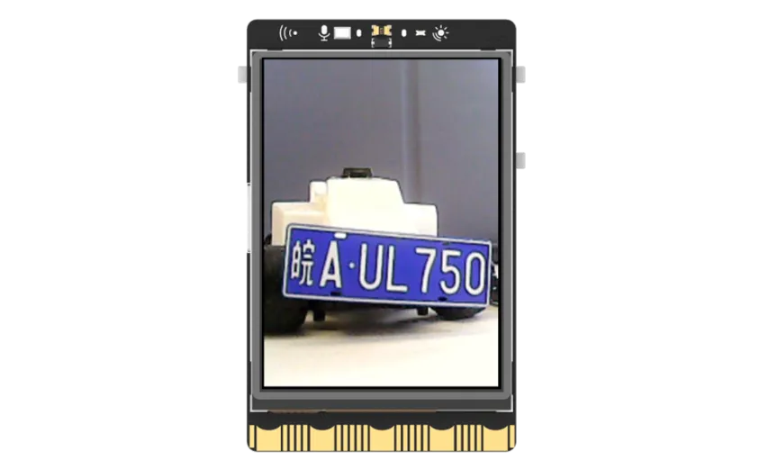
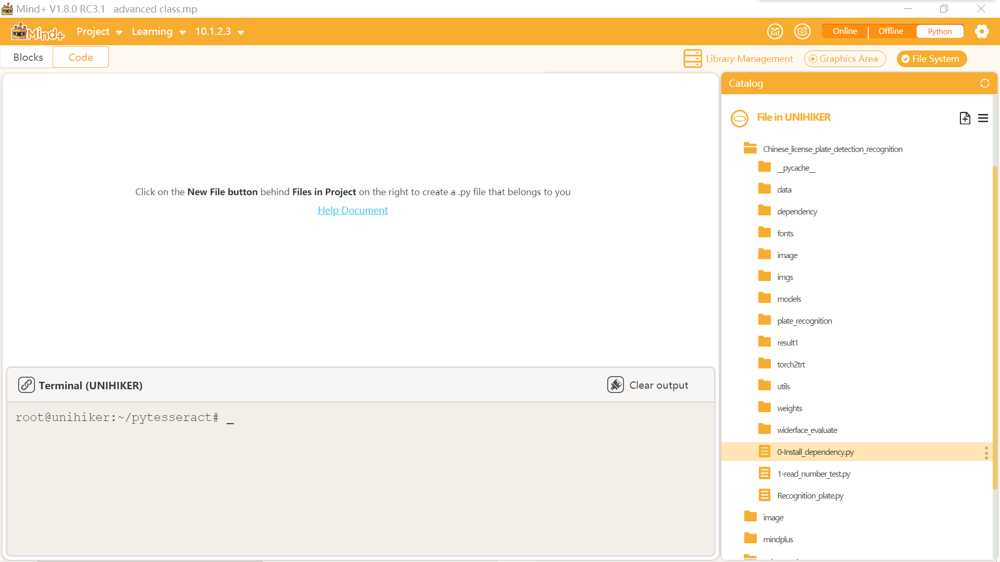
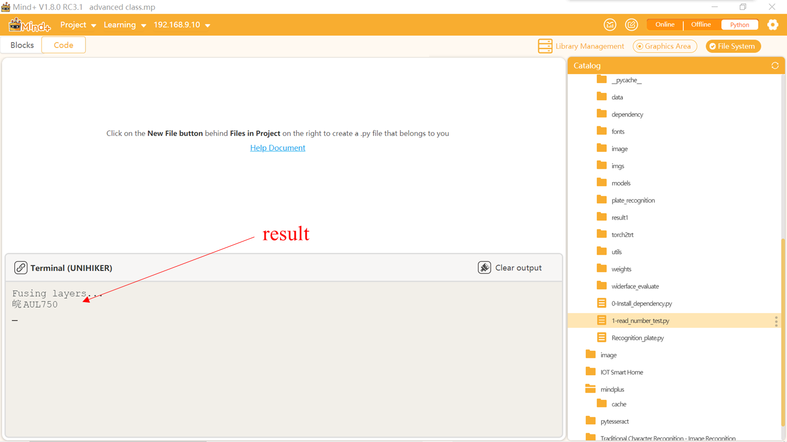

## **Project Introduction**
This project aims to connect an external USB camera to the UNIHIKER and utilize the camera along with the YOLO model to accurately identify license plate numbers.  

In the first step, we will familiarize ourselves with the OpenCV library for reading video frames and saving images. This small project will provide us with a fundamental understanding of license plate recognition principles, and in the end, we will gain a basic understanding of the YOLO model.  

The main process involves using the OpenCV library to read images from the external camera, resizing them to a resolution of 240x320, and displaying them on the line UNIHIKER screen. Then, specific recognition conditions are set, and by pressing button a, the recognize() function of the Recognition_plate module is called to identify the license plate numbers. For further customization, the functionalities and parameters of the OpenCV library can be explored.  

  

## **Hardware Required**

- [UNIHIKER](https://www.dfrobot.com/product-2691.html)
- [MegaPixels USB Camera for Raspberry Pi / NVIDIA Jetson Nano / UNIHIKER](https://www.dfrobot.com/product-2089.html)

{width=400， style="display:block;margin: 0 auto"}  

## **Code**
To begin, the license plate recognition folder should be imported by dragging and dropping the Chineselyscense_plate_detection_decognition folder into the 'Files in the line UNIHIKER' folder. Next, the '0-Install_dependency.py' program file in the 'Chineselyscense_plate_detection_decognition' should be opened by double-clicking on it. Then, click the run button in the upper right corner and wait for automatic installation to complete. Finally, a new project file with the name "1-read_number_test.py" should be created in the same level directory as "0-Install_dependency.py".  

Tip 1: Please refrain from modifying the folder path and leave it as it is (under root).  

Tip 2: This folder contains necessary files for license plate recognition, including the recognition models. The "0-Install_dependency.py" program file is used for installing the required dependency libraries, and the "Recognition_plate.py" is a pre-written program module specifically for license plate recognition.  

{width=400， style="display:block;margin: 0 auto"}  

By opening the "Recognition_plate.py" file, it can be observed that the code mainly utilizes the YOLO model for license plate detection and recognition. The key steps involved are as follows:    
  
1. Load Model: The pre-trained license plate detection and recognition model is loaded using the load_model function. The YOLO model is saved in the models folder.  
2. Image preprocessing: Within the detectability recognition_plate function, the input image is initially preprocessed, involving scaling, cropping, and other operations. This preprocessed image is then converted into a format suitable for the model.  
3. License plate detection: The preprocessed image is then input into the license plate detection model to obtain the position and coordinates of the key points of the license plate.  
4. Obtain license plate image: With the key point coordinates, a perspective transformation is applied using the four_point_transform function to obtain the image of the license plate.  
5. License plate recognition: Finally, the license plate image is input into the license plate recognition model to obtain the license plate number. If the color recognition option is set, the color of the license plate can also be determined.  
6. Result processing: The results of the detection and recognition process, including information such as license plate location, license plate number, and license plate color, are organized and presented.  
7. Result display: The draw_result function is utilized to draw the detection and recognition results onto the original image, indicating the location and number of the license plate.  


```python
import sys
sys.path.append("/root/Chinese_license_plate_detection_recognition")
import Recognition_plate  # Import license plate recognition module
import cv2
import numpy as np


cap = cv2.VideoCapture(0)  # Turn on the camera
cap.set(cv2.CAP_PROP_FRAME_WIDTH, 240)  # Set the width of the camera
cap.set(cv2.CAP_PROP_FRAME_HEIGHT, 320)  # Set the height of the camera
cap.set(cv2.CAP_PROP_BUFFERSIZE, 1)  # Set the buffer size of the camera
cv2.namedWindow('cvwindow', cv2.WND_PROP_FULLSCREEN)
cv2.setWindowProperty('cvwindow', cv2.WND_PROP_FULLSCREEN, cv2.WINDOW_FULLSCREEN)  # Set the window to full screen

while not cap.isOpened():  # If the camera is not turned on, keep waiting
    continue

while True:  # Main cycle
    cv2.waitKey(5)  # Wait for 5 milliseconds
    cvimg_success, img_src = cap.read()  # Read the image from the camera
    cvimg_h, cvimg_w, cvimg_c = img_src.shape  # Obtain the width, height, and number of channels of the image
    cvimg_w1 = cvimg_h * 240 // 320  
    cvimg_x1 = (cvimg_w - cvimg_w1) // 2
    img_src = img_src[:, cvimg_x1:cvimg_x1 + cvimg_w1]  # Adjust the size of the screen
    img_src = cv2.resize(img_src, (240, 320))  # Zoom the screen to 240x320
    cvimg_src = img_src.copy()  # Copy Screen
    cv2.imshow('cvwindow', cvimg_src)  # display frame
    if cv2.waitKey(1) & 0xFF == ord('a'):
        cv2.imwrite("/root/Chinese_license_plate_detection_recognition/imgs/3.png", cvimg_src)  # Save the current screen
        number = Recognition_plate.recognize()  # recognize
        print(number)  # Perform license plate recognition and print the results

```
## **Demo Effect**
{width=400， style="display:block;margin: 0 auto"}



---
