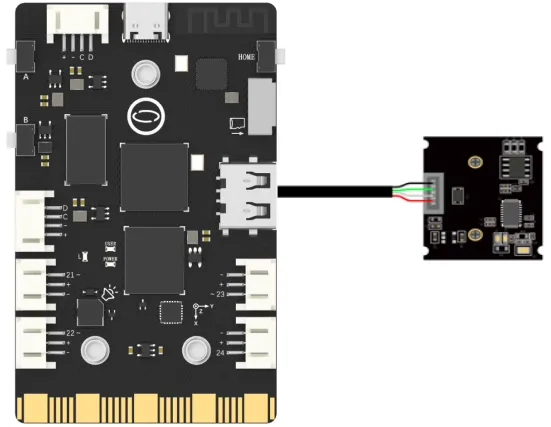

## **Project Introduction**
To create a Color Following Car, a USB camera can be used as an expansion module.   

The OpenCV library in Python provides the VideoCapture() method, which can be utilized to control a USB camera using the UNIHIKER. 

To control the color tracking device and shoot a video, the read() and imshow() methods from the OpenCV library in Python can be used. This allows us to read the video stream from the camera and display it on the UNIHIKER board's screen. Additionally, the font = cv2.FONT_HERSHEY_SIMPLEX function can be utilized to enable color tracking for screen text display. Different functionalities and parameters of the OpenCV library can be experimented with to customize the DIY Color Following Car.  

![20240801_215948[00h00m04s-00h00m09s].gif](img/6_Color_Following_Car/1722520903525-bdfb4608-5d6a-4ebb-9f27-10da7bdebff7.gif){width=400， style="display:block;margin: 0 auto"}    

## **Hardware Required**

- [UNIHIKER](https://www.dfrobot.com/product-2691.html)
- [MegaPixels USB Camera for Raspberry Pi / NVIDIA Jetson Nano / UNIHIKER](https://www.dfrobot.com/product-2089.html)

{width=400， style="display:block;margin: 0 auto"}    

## **Code**
To implement video streaming and capturing with the Color Following Car, the OpenCV library in Python can be utilized.   
First, import cv2 and use cap = cv2.VideoCapture(0) to initialize the camera's function for video output. Then, cap.set(), cv2.namedWindow(), and cv2.setWindowProperty() can be used to set the frame rate, window initialization, and window size of the video stream. In the main loop, ret, frame = cap.read() can be used to initialize the video stream parameters. Using if statements, we can check if a certain key has been pressed. To close the camera, the function cap.release() can be implemented when the key 'b' is pressed.   

In terms of color tracking, the lower_green = np.array([]) function is used to define the threshold parameters of the colors we want to identify. The mask_green = cv2.inRange() function is used to take specially processed values for the colors that need to be recognized in the recognized images. The contours, hierarchy = cv2.findContours() function is used to transfer the processed image contours obtained. To customize the Color Following Car project, various parameters and functions can be experimented with.  


```python
import numpy as np
import cv2
font = cv2.FONT_HERSHEY_SIMPLEX
lower_green = np.array([35, 43, 35])  # Green range low threshold
upper_green = np.array([90, 255, 235])  # Green range high threshold
lower_red = np.array([0, 60, 60])  # Red range low threshold
upper_red = np.array([6, 255, 255])  # Red range high threshold
lower_blue = np.array([100, 80, 46])  # Green range low threshold
upper_blue = np.array([124, 255, 255])  # Green range low threshold 

cap = cv2.VideoCapture(0)  # Open USB camera
# Set the camera buffer to 1, to decrease the latency.
cap.set(cv2.CAP_PROP_BUFFERSIZE, 1) 
# Set the windows to be full screen.
cv2.namedWindow('dection',cv2.WND_PROP_FULLSCREEN) 
# Set the windows to be full screen.
cv2.setWindowProperty('dection',cv2.WND_PROP_FULLSCREEN, cv2.WINDOW_FULLSCREEN) 

if (cap.isOpened()):  # Video successfully opened
 flag = 1
else:
 flag = 0
num = 0
if (flag):
  while(True):
    ret, frame = cap.read()  # Read a frame
    if ret == False:  # Frame reading failed
        break
    h, w, c = frame.shape  # Record the shape and size of the image, including height, width, and channel
    w1 = h*240//320  # change the height to fit the render image
    x1 = (w-w1)//2  # midpoint of width without resizing
    frame = frame[:, x1:x1+w1]  # crop into the center
    frame = cv2.resize(frame, (240, 320))  # resize according to the screen keeping the aspect ratio
    
    key = cv2.waitKey(1)  # Refresh the image every 1ms, and the delay cannot be 0, otherwise the read result will be a static frame
    hsv_img = cv2.cvtColor(frame, cv2.COLOR_BGR2HSV)   
      
    mask_green = cv2.inRange(hsv_img, lower_green, upper_green)  # Select based on color range
    mask_green = cv2.medianBlur(mask_green, 7)  # median filtering 
      
    mask_red = cv2.inRange(hsv_img, lower_red, upper_red) 
    mask_red = cv2.medianBlur(mask_red, 7)
      
    mask_blue = cv2.inRange(hsv_img, lower_blue, upper_blue)
    mask_blue = cv2.medianBlur(mask_blue, 7)

    contours, hierarchy = cv2.findContours(mask_green, cv2.RETR_EXTERNAL, cv2.CHAIN_APPROX_NONE)
    
    contours2, hierarchy2 = cv2.findContours(mask_red, cv2.RETR_EXTERNAL, cv2.CHAIN_APPROX_NONE)
    
    contours3, hierarchy3 = cv2.findContours(mask_blue, cv2.RETR_EXTERNAL, cv2.CHAIN_APPROX_NONE)
    

    for cnt in contours:
        (x, y, w, h) = cv2.boundingRect(cnt)
        cv2.rectangle(frame, (x, y), (x + w, y + h), (0, 255, 255), 2)
        cv2.putText(frame, "Green", (x, y - 5), font, 0.7, (0, 255, 0), 2)

    for cnt2 in contours2:
        (x2, y2, w2, h2) = cv2.boundingRect(cnt2)
        cv2.rectangle(frame, (x2, y2), (x2 + w2, y2 + h2), (0, 255, 255), 2)
        cv2.putText(frame, "Red", (x2, y2 - 5), font, 0.7, (0, 0, 255), 2)

    for cnt3 in contours3:
        (x3, y3, w3, h3) = cv2.boundingRect(cnt3)
        cv2.rectangle(frame, (x3, y3), (x3 + w3, y3 + h3), (0, 255, 255), 2)
        cv2.putText(frame, "Blue", (x3, y3 - 5), font, 0.7, (255, 0, 0), 2)
        
    cv2.imshow("dection", frame)
    if key & 0xFF == ord('b'):
        break

cv2.waitKey(0)
cv2.destroyAllWindows()
```
## **Demo Effect**
![20240801_215948[00h00m04s-00h00m09s].gif](img/6_Color_Following_Car/1722520924507-36034f34-ef0c-4519-9c2c-741f6a5c0b3e.gif){width=400， style="display:block;margin: 0 auto"}  


---
