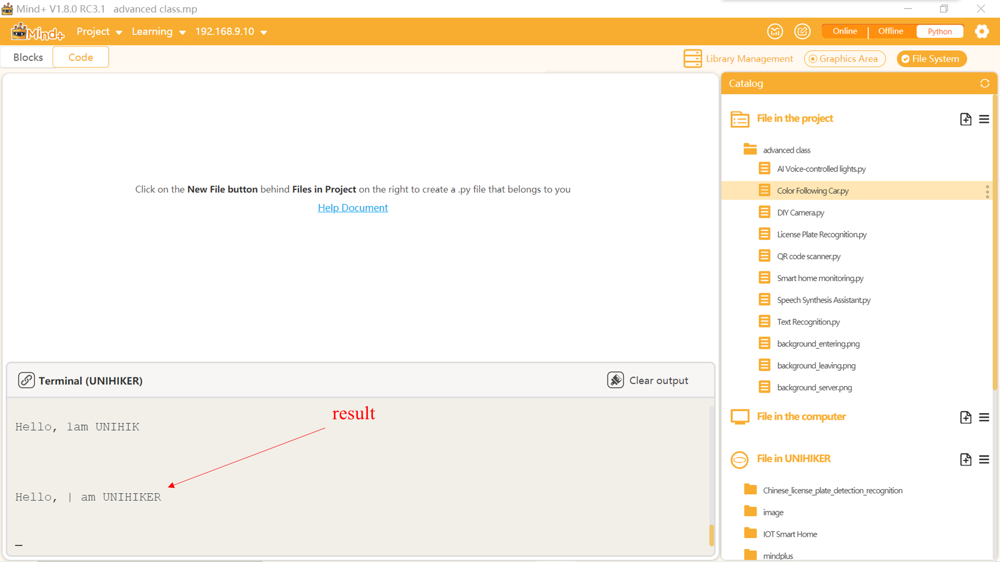

## **Project Introduction**
Instead of manually typing out words read from books, a more efficient approach could be using the OCR function. OCR technology involves converting text from printed materials into digital image information using electronic devices such as scanners or cameras, and then applying text recognition technology to convert the image into computer-readable text using artificial intelligence. In this project, we will connect a camera to the UNIHIKER and utilize the Python pytexteract library to create a text recognition device that can recognize text from photos and output it onto paper.  

This project aims to connect a camera to the UNIHIKER and utilize the Python pytesseract library to create a text recognition device that can recognize text from photos and output it onto paper.  

{width=300， style="display:block;margin: 0 auto"}
## **Hardware Required**

- [UNIHIKER](https://www.dfrobot.com/product-2691.html)
- [MegaPixels USB Camera for Raspberry Pi / NVIDIA Jetson Nano / UNIHIKER](https://www.dfrobot.com/product-2089.html)

{width=400， style="display:block;margin: 0 auto"}
## **Code**
To begin, the license plate recognition folder should be imported by dragging and dropping the pytesseract folder into the 'Files in the line UNIHIKER' folder. Next, the '0-Install_dependency.py' program file in the 'pytesseract' should be opened by double-clicking on it. Then, click the run button in the upper right corner and wait for automatic installation to complete. Finally, a new project file with the name "1-read_number_test.py" should be created in the same level directory as "0-Install_dependency.py".  

Tip 1: Please refrain from modifying the folder path and leave it as it is (under root).  
Tip 2: This folder contains necessary files for license plate recognition, including the recognition models. The "0-Install_dependency.py" program file is used for installing the required dependency libraries.  


The first step is to introduce essential function libraries, including the OpenCV library for image recognition and the pyteseract library for text recognition. Afterward, a callback function is set up to display the recognized text on UNIHIKER's screen.    

The following steps are similar to the DIY camera section in the third chapter of the Advanced Class, with the only difference being the use of the method ShiBieNaRong = pytesseract.image_to_string() for text recognition and extraction after taking photos.
```python
#  -*- coding: UTF-8 -*-

# MindPlus
# Python
import sys
sys.path.append("/root/mindplus/.lib/thirdExtension/nick-pytesseract-thirdex")
# from pinpong.board import Board
from pinpong.board import Board,Pin
from pinpong.extension.unihiker import *
# from pinpong.libs.dfrobot_speech_synthesis import DFRobot_SpeechSynthesis_I2C
import time
import cv2
import pytesseract
from PIL import Image,ImageFont,ImageDraw
import os
import numpy as np


Board().begin()
# p_gravitysynthesis = DFRobot_SpeechSynthesis_I2C()
# p_gravitysynthesis.begin(p_gravitysynthesis.V2)
def draw(text,x,y,size,r, g, b, a,img):
    font = ImageFont.truetype("HYQiHei_50S.ttf", size)
    img_pil = Image.fromarray(img)
    draw = ImageDraw.Draw(img_pil)
    draw.text((x,y), text, font=font, fill=(b, g, r, a))
    frame = np.array(img_pil)
    return frame

pytesseract.pytesseract.tesseract_cmd = r'/usr/bin/tesseract'
cap = cv2.VideoCapture(0)
cap.set(cv2.CAP_PROP_FRAME_WIDTH, 240)
cap.set(cv2.CAP_PROP_FRAME_HEIGHT, 320)
cap.set(cv2.CAP_PROP_BUFFERSIZE, 1)
cv2.namedWindow('cvwindow',cv2.WND_PROP_FULLSCREEN)
cv2.setWindowProperty('cvwindow', cv2.WND_PROP_FULLSCREEN, cv2.WINDOW_FULLSCREEN)
while not cap.isOpened():
    continue
print("start!")
ShiBieNaRong = ''
img_word1 = ''
img_word2 = ''

while True:
    cv2.waitKey(5)
    cvimg_success, img_src = cap.read()
    cvimg_h, cvimg_w, cvimg_c = img_src.shape
    cvimg_w1 = cvimg_h*240//320
    cvimg_x1 = (cvimg_w-cvimg_w1)//2
    img_src = img_src[:, cvimg_x1:cvimg_x1+cvimg_w1]
    img_src = cv2.resize(img_src, (240, 320))
    cv2.imshow('cvwindow', img_src)
    if (button_a.is_pressed()==True):
        ShiBieNaRong = []
        try:
            if not os.path.exists("/root/image/pic/"):
                print("The folder does not exist,created automatically")
                os.system("mkdir -p /root/image/pic/")
        except IOError:
            print("IOError,created automatically")
            break
        cv2.imwrite("/root/image/pic/image.png",img_src)
        time.sleep(0.2)
        img = Image.open('/root/image/pic/image.png')
        ShiBieNaRong = pytesseract.image_to_string(img, lang='chi_sim')
        print(ShiBieNaRong)
    img_src = draw(text=str(ShiBieNaRong),x=10, y=20,size=20,r= 50,g=200,b=0,a=0,img=img_src)
    cv2.imshow('cvwindow', img_src)
    
cap.release() # Release usb camera.  # Release the camera
cv2.destroyAllWindows() # Destory all windows created by opencv.  # Close all
```
## **Demo Effect**
## 
{width=300， style="display:block;margin: 0 auto"}



---
