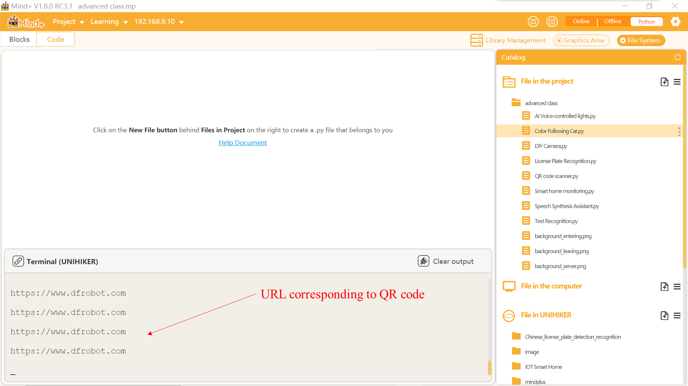

## **Project Introduction**
This project connects an external USB camera on the UNIHIKER to detect QR codes and display the recognition results in real-time on the screen.  

To control a USB camera using the UNIHIKER, we can use the VideoCapture() method from the OpenCV library in Python. This will allow us to access and control the camera through the side interface of the board.

To control the DIY Camera and shoot a video, we can use the read() and imshow() methods from the OpenCV library in Python. This will allow us to read the video stream from the camera and display it on the UNIHIKER board's screen. You can explore different functionalities and parameters of the OpenCV library to customize your QR Code Scanner.  

![20240801_215321[00h00m00s-00h00m06s].gif](img/8_QR_Code_Scanner/1722520579761-9323c717-8d22-434a-a1dd-ec9de7e3ea6f.gif){width=400， style="display:block;margin: 0 auto"}  

## **Hardware Required**

- [UNIHIKER](https://www.dfrobot.com/product-2691.html)
- [MegaPixels USB Camera for Raspberry Pi / NVIDIA Jetson Nano / UNIHIKER](https://www.dfrobot.com/product-2089.html)

{width=400， style="display:block;margin: 0 auto"}
## **Code**
To begin, the license plate recognition folder should be imported by dragging and dropping the pytesseract folder into the 'Files in the line UNIHIKER' folder. Next, the '0-Install_dependency.py' program file in the 'pytesseract' should be opened by double-clicking on it. Then, click the run button in the upper right corner and wait for automatic installation to complete. Finally, a new project file with the name "1-read_number_test.py" should be created in the same level directory as "0-Install_dependency.py".   

Tip 1: Please refrain from modifying the folder path and leave it as it is (under root).  
Tip 2: This folder contains necessary files for license plate recognition, including the recognition models. The "0-Install_dependency.py" program file is used for installing the required dependency libraries.  

In the "main.py" file, the OpenCV library is primarily used to call the camera and obtain real-time video streams. Then, the Pyzbar library's decode method is utilized to detect and parse the string represented by the QR code, obtain the coordinates of the recognized QR code, draw a recognition box, and display the recognition content in real time. By using cap.read(), one frame of image can be read from the camera. Based on the preset coordinates and size (combined with the line UNIHIKER's screen size), a specific area is cropped from the captured image for subsequent QR code detection. Finally, the decode() function is applied to decode the QR code within the cropped image area.  

```python
import cv2  # Import OpenCV library
import time  # Import time library for processing time related functions
import numpy as np  # Import numpy library for processing numerical calculations
from pyzbar.pyzbar import decode  # Import decode function from pyzbar library for decoding QR codes
 
def main():  # Define the main function
    cap = cv2.VideoCapture(0)  # Turn on the camera, '0' represents the default camera
    while not cap.isOpened():  # If the camera does not turn on successfully, wait in a loop
        continue
    cap_w, cap_h = 240, 320  # Set the width and height of the image captured by the camera
    cv2.namedWindow("qrwindows", cv2.WND_PROP_FULLSCREEN)  # Create a window named 'qrwindows'
    cv2.setWindowProperty("qrwindows",cv2.WND_PROP_FULLSCREEN, cv2.WINDOW_FULLSCREEN)  # Set window 'qrwindows' to full screen display
 
    while True:  
        qrimg_success, qrimg_src = cap.read()  # Read a frame of image from the camera
        xmin, ymin, w, h = 250, 100, cap_w, cap_h  # Set the position and size of the image area to be processed
        qrimg_src = qrimg_src[ymin:ymin+h, xmin:xmin+w]  # Crop a specified size area from the image captured by the camera
        qrcode_val = decode(qrimg_src)  # Use pyzbar's decode function to decode QR codes in cropped images
 
        if len(qrcode_val) > 0:  # If at least one QR code is decoded
            for i in range(len(qrcode_val)):  # Traverse all decoded QR codes
                qrcode_str = qrcode_val[i][0].decode()  # Retrieve the text content of the QR code
                print(qrcode_str)  # Print the text content of the QR code on the console
                # The following code retrieves the coordinates of the QR code positioning point and draws a recognition box and positioning point
                point_x = qrcode_val[i][2][0]
                point_y = qrcode_val[i][2][1]
                point_w = qrcode_val[i][2][2]
                point_h = qrcode_val[i][2][3]
                point_1_x = qrcode_val[i][3][0][0]
                point_1_y = qrcode_val[i][3][0][1]
                point_2_x = qrcode_val[i][3][1][0]
                point_2_y = qrcode_val[i][3][1][1]
                point_3_x = qrcode_val[i][3][2][0]
                point_3_y = qrcode_val[i][3][2][1]
                point_4_x = qrcode_val[i][3][3][0]
                point_4_y = qrcode_val[i][3][3][1]
                # Draw recognition box
                cv2.rectangle(qrimg_src, (point_x, point_y), (point_x+point_w, point_y+point_h), (255, 0, 255), 2)
                # Draw the line connecting the positioning points
                cv2.line(qrimg_src, (point_1_x, point_1_y), (point_2_x, point_2_y), (255, 0, 0), 2, cv2.FILLED)
                cv2.line(qrimg_src, (point_2_x, point_2_y), (point_3_x, point_3_y), (255, 0, 0), 2, cv2.FILLED)
                cv2.line(qrimg_src, (point_3_x, point_3_y), (point_4_x, point_4_y), (255, 0, 0), 2, cv2.FILLED)
                cv2.line(qrimg_src, (point_4_x, point_4_y), (point_1_x, point_1_y), (255, 0, 0), 2, cv2.FILLED)
                # Draw positioning points
                cv2.circle(qrimg_src, (point_1_x, point_1_y), 5, (255, 0, 0), 2)
                cv2.circle(qrimg_src, (point_2_x, point_2_y), 5, (0, 255, 0), 2)
                cv2.circle(qrimg_src, (point_3_x, point_3_y), 5, (0, 0, 255), 2)
                cv2.circle(qrimg_src, (point_4_x, point_4_y), 5, (255, 255, 0), 2)
                # Display the text content of the QR code above the recognition box
                cv2.putText(qrimg_src,qrcode_str,(point_x,point_y-15), cv2.FONT_HERSHEY_COMPLEX, 0.4, (0, 0, 255), 1)
            cv2.imshow('qrwindows', qrimg_src)  # Display an image with a recognition box and text in the window 'qrwindows'
            cv2.waitKey(10)  
            time.sleep(1)  # Wait for 1 second
        else:
            cv2.imshow('qrwindows', qrimg_src)  # If no QR code is detected, display the original image in the window 'qrwindows'
            cv2.waitKey(10)  
 
if __name__ == '__main__':  # If this file runs as the main program
    main()  # Call the main function
```
## **Demo Effect**
![20240801_215321[00h00m00s-00h00m06s].gif](img/8_QR_Code_Scanner/1722520660463-d8df7d4c-4b0b-42da-8d54-da1b0e93c3e3.gif){width=400， style="display:block;margin: 0 auto"}  



---
