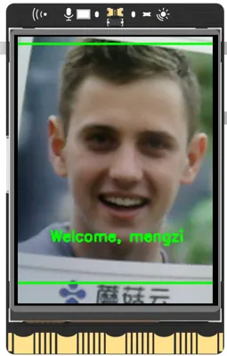
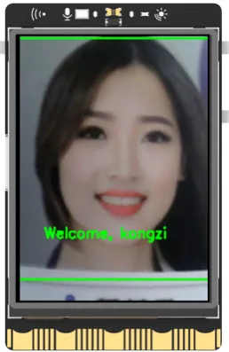
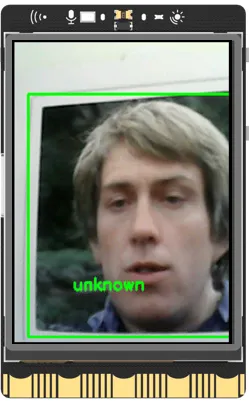
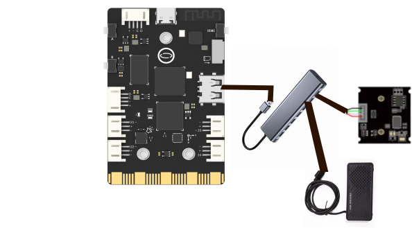
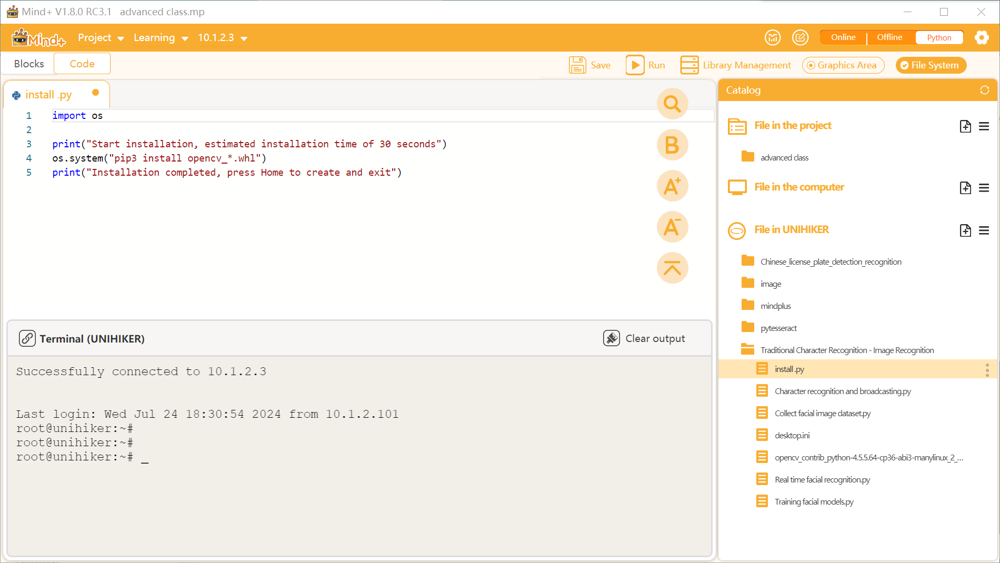
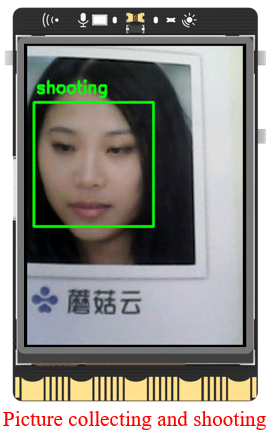
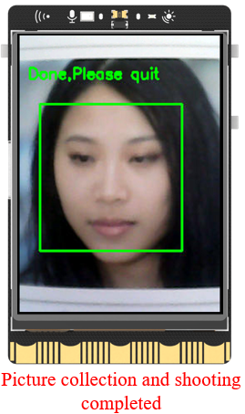
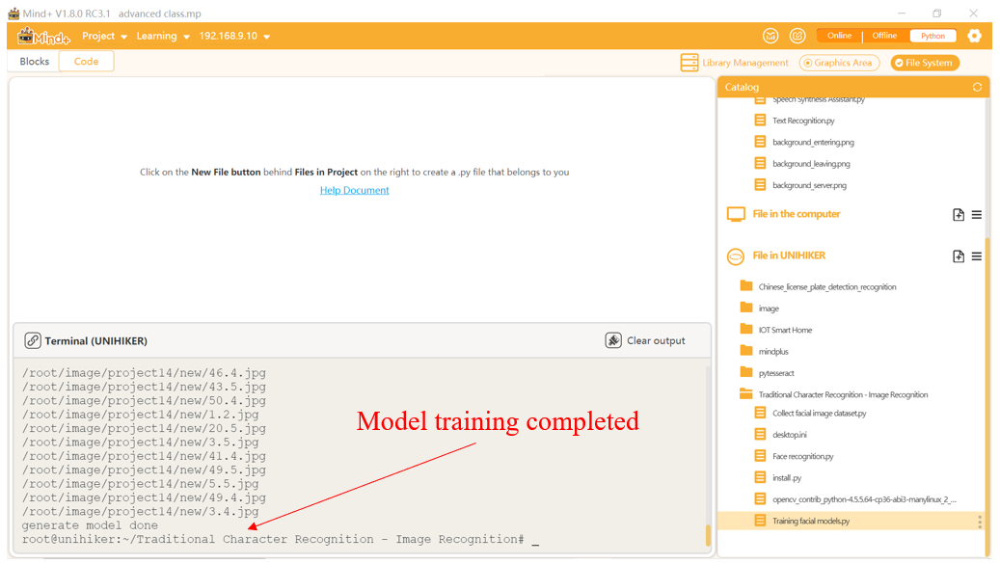

## **Project Introduction**
Access control is a widely used tool in our daily lives. Have you ever wondered how it works? In this class, we will simulate and experience this function by combining the UNIHIKER and camera. Let's explore how this can be achieved.
This project utilizes a USB camera to display the screen in real-time. When a face is detected on the screen, a welcome message and the person's name are added.  

In this project, we will learn how to use the OpenCV library to call a camera and display real-time video streams. We will also learn how to use the OpenCV library for face detection. Additionally, we will master the method of converting image formats using the PIL library's Image module, as well as the method of pasting images onto other images using the PIL library's Image module. You can experiment with different functionalities and parameters of the OpenCV library to customize your Face Recognition project.  


  

## **Hardware Required**

- [UNIHIKER](https://www.dfrobot.com/product-2691.html)
- [MegaPixels USB Camera for Raspberry Pi / NVIDIA Jetson Nano / UNIHIKER](https://www.dfrobot.com/product-2089.html)
- USB Docking Station
- USB Speaker

{width=400， style="display:block;margin: 0 auto"}
## **Code**
Facial detection is the process of searching for a face in a given image and determining its position, size, and pose. It is achieved by using a certain strategy and is often performed using a classifier, which helps determine whether an object belongs to a certain classification. A cascaded classifier can be thought of as a series of N single class classifiers. If an object meets the criteria of all classifiers in the series, then it is considered a valid result. For example, a human face has multiple attributes, and each attribute can be turned into a classifier. If a model satisfies all the attributes we define for a face (two eyebrows, two eyes, one nose, one mouth, a roughly U-shaped chin or contour, etc.), then it is considered a human face.  

Before starting the project, make sure to install the necessary libraries as shown in Section 7 of this chapter. The installation file is called 'install.py' and can be found in the 'Traditional Character Recognition - Image Recognition' folder.  

  

To open and initialize a camera for displaying real-time video streams, the "VideoCapture()" function from the OpenCV library can be used. Before using this function, make sure to import the OpenCV library. A specific parameter number must be entered to indicate which camera to turn on. If there are multiple cameras, entering the numbers "0" and "1" represents the first and second cameras, respectively. If there is only one camera, either "0" or "-1" can be used as the camera ID number.  

We have provided comments in the code below to explain the specific functions and their purposes. Please refer to these comments for a better understanding of the code.  

The first code is used for collecting facial data. We collect facial data by taking photos with a USB camera.  

```python
'''
Run the program, enter the ID on the terminal and press enter. The screen will display the image of the camera. Adjust the position and start taking photos when a green box appears. If done is displayed, the process is complete.
The captured images are saved in the/root/image/project14/new folder. This code captures 50 images, and the code parameters can be modified to capture more images.
'''

import cv2  # Import OpenCV library
import os  # Import OS library

img_src='/root/image/project14'  # Define image path (in Mind+, it needs to be specified to a fixed position when running)
os.system('mkdir -p '+img_src+'/new/')  # Create a folder named 'new' in this path (a folder needs to be created before storing images)

cap = cv2.VideoCapture(-1)  # Open camera 0 and initialize it
cap.set(cv2.CAP_PROP_BUFFERSIZE, 1)  # Set a buffer of 1 frame to reduce latency
cv2.namedWindow('frame',cv2.WND_PROP_FULLSCREEN)  # Build a window named winname with the default attribute of being able to display in full screen
cv2.setWindowProperty('frame', cv2.WND_PROP_FULLSCREEN, cv2.WINDOW_FULLSCREEN)  # Set Winname window to full screen

font = cv2.FONT_HERSHEY_SIMPLEX  # Set font type (normal size sans serif font)
detector=cv2.CascadeClassifier(cv2.data.haarcascades+ 'haarcascade_frontalface_default.xml')  # Load face detection classifier
sampleNum = 0  # Define the initial number of image samples as 0
ID = input('enter your id: ')  # Enter the category number of facial image data

while True:
    ret, img = cap.read()  # Read images by frame
    #img = cv2.flip(img, 1)  # Mirror (flip the img image horizontally)
    if ret:  # If an image is read  
        h, w, c = img.shape  # Record the shape and size of the image, including height, width, and channel
        w1 = h*240//320
        x1 = (w-w1)//2
        img = img[:, x1:x1+w1]  # Crop image
        img = cv2.resize(img, (240, 320))  # Adjust the image size to match the spacing board
        gray = cv2.cvtColor(img, cv2.COLOR_BGR2GRAY)  # Convert image img to grayscale image
        faces = detector.detectMultiScale(gray, 1.3, 5)  # Detect and obtain facial recognition data
        for (x, y, w, h) in faces:  # Detect facial features
            cv2.rectangle(img, (x, y), (x + w, y + h), (0, 255, 0), 2)  # Draw a box rectangle on the face
            sampleNum = sampleNum + 1  # Number of pictures recorded+1
            if sampleNum <= 50:  # If the quantity does not exceed 50 sheets
                cv2.putText(img, 'shooting', (10, 50), font, 0.6, (0, 255, 0), 2)  # Displaying the text 'shooting' on the image screen indicates that facial recognition is being collected
                # Save a partial image of the face and name it according to the rule sampleNum UserID.jpg
                cv2.imwrite(img_src +'/new/'+ str(sampleNum) + '.' + str(ID) + ".jpg",gray[y:y + h, x:x + w])
            else:  # If the number of images is greater than 50
                cv2.putText(img, 'Done,Please quit', (10, 50), font, 0.6, (0, 255, 0), 2)  # Display text to remind completion
        cv2.imshow('frame', img)  # Display image img on frame window

        key = cv2.waitKey(1)  # Each frame of data is delayed by 1ms, and the delay cannot be 0, otherwise the read result will be a static frame
        if key & 0xFF == ord('b'):  # Press the B key to exit
            break

cap.release()  # Release the camera
cv2.destroyAllWindows()  # Close all
```
The completion result of the first code run:  

  

Tips: You can use the above method to run the program multiple times and collect multiple additional faces.
The second code is used to train a facial recognition model. Through this code, we will use the collected facial data to train the model and prepare for the subsequent facial recognition.  

```python
# Run this program to train the captured facial images and obtain the model. yml model (at the same level as the new folder)
import cv2  # Import OpenCV library
import os  # Import OS library
import numpy as np  # Import numpy library
from PIL import Image  # Import PIL library Image module

img_src='/root/image/project14'  # Define save path (in Mind+, it needs to be specified to a fixed location when running)

# Initialize face detector and recognizer
detector=cv2.CascadeClassifier(cv2.data.haarcascades+ 'haarcascade_frontalface_default.xml')  # Load face detection classifier
recognizer = cv2.face.LBPHFaceRecognizer_create()  # Generate LBPH recognizer instance model (empty)

'''
Traverse the image path, import the image and ID, and add them to the list
'''
def get_images_and_labels(path):
    # Splicing the image path to correspond to the specific image names, such as/root/image/project14/new/50.1.jpg, and storing them in the image_caths list
    image_paths = [os.path.join(path, f) for f in os.listdir(path)] 
    # Create a list of face samples (empty)
    face_samples = [] 
    # Create ID sample list (empty)
    ids = []  
    for image_path in image_paths:  # Traverse the image path
        # Print the name of each image (image name with path)
        print(image_path) 
        # Convert color images to grayscale images
        image = Image.open(image_path).convert('L')
        # Convert the format of the grayscale image into a Numpy array again
        image_np = np.array(image, 'uint8')
        '''To obtain the ID, we split the path of the image and obtain relevant information'''
        # Split by '.', if the last group is' jpg ', proceed to the following steps
        if os.path.split(image_path)[-1].split(".")[-1] != 'jpg':
            continue
        # Retrieve the ID number from the image with the complete path name, where the ID is the one we set when collecting the image
        image_id = int(os.path.split(image_path)[-1].split(".")[1])
        # Detect facial images in array format and store the results in faces
        faces = detector.detectMultiScale(image_np)  # Detecting faces
        # Crop the face image in array format and store the face parts in the face sample list, and then store the ID numbers of the images in the ID sample list
        for (x, y, w, h) in faces:
            face_samples.append(image_np[y:y + h, x:x + w])
            ids.append(image_id)
    return face_samples, ids  # Return the list of face samples and ID samples


# Train and output the corresponding face model (in. yml format) using the LBPH recognizer model
faces, Ids = get_images_and_labels(img_src+'/new/')  # Enter the path and image folder name to obtain the list of face samples and ID samples
recognizer.train(faces, np.array(Ids))  # Pass the face sample list and ID sample list into an empty LBPH recognizer model to obtain a complete face model
recognizer.save(img_src+'/model.yml')  # Save the generated model
print("generate model done")  # Print 'Model Generated'

```
The completion result of the second code run:

The third code is used for facial recognition. Its function is to recognize faces and print the words "Welcome, Person Name" on the screen, and broadcast the person's name through a USB speaker.
```python
'''Run this program and use the trained face model to predict faces. When a trained face is detected, display the welcome message and the person's name, and broadcast the person's name; When an unfamiliar face is detected, it displays "unknown", and the more images collected, the higher the recognition accuracy'''
import cv2  # Import OpenCV library
from pinpong.board import Board  # Import Pinpong Library
import time  # Import time library
import pyttsx3  # Import pyttsx3 library

Board("UNIHIKER").begin()  # Initialize, select board type, and automatically recognize without inputting board type

img_src='/root/image/project14'  # Define save path (in Mind+, it needs to be specified to a fixed location when running)

engine = pyttsx3.init()  # Initialize TTS engine and create engine objects
cap = cv2.VideoCapture(-1)  # Open camera 0 and initialize it
cap.set(cv2.CAP_PROP_BUFFERSIZE, 1)  # Set a buffer of 1 frame to reduce latency
cv2.namedWindow('frame',cv2.WND_PROP_FULLSCREEN)  # Build a window named winname with the default attribute of being able to display in full screen
cv2.setWindowProperty('frame', cv2.WND_PROP_FULLSCREEN, cv2.WINDOW_FULLSCREEN)  # Set Winname window to full screen
font = cv2.FONT_HERSHEY_SIMPLEX  # Set font type (normal size sans serif font)

'''Initialize the face detector and recognizer, referencing the previously trained. yml file to recognize faces'''
detector=cv2.CascadeClassifier(cv2.data.haarcascades+ 'haarcascade_frontalface_default.xml')  # Load face detection classifier
recognizer = cv2.face.LBPHFaceRecognizer_create()  # Generate LBPH recognizer instance model
recognizer.read(img_src+'/model.yml')  # Read the trained face model under this path

count = 0  # Define a count tag called 'count'

while True:
    ret, img = cap.read()  # Read images by frame
    if ret:  # If an image is read   
        h, w, c = img.shape  # Record the shape and size of the image, including height, width, and channel
        w1 = h*240//320
        x1 = (w-w1)//2
        img = img[:, x1:x1+w1]  # Crop image
        img = cv2.resize(img, (240, 320))  # Adjust the image size to match the spacing board
        gray = cv2.cvtColor(img, cv2.COLOR_BGR2GRAY)  # Convert image img to grayscale image
        faces = detector.detectMultiScale(gray, 1.2, 5)  # Detect and obtain facial recognition data
        for (x, y, w, h) in faces:
            cv2.rectangle(img, (x - 50, y - 50), (x + w + 50, y + h + 50), (0, 255, 0), 2)  # Draw a box rectangle on the face
            img_id, confidence = recognizer.predict(gray[y:y + h, x:x + w])  # First, specify a square area on the grayscale image (which is used to present the face), and then predict only that area
            if img_id == 1:
                img_name = 'Welcome, kongzi'
                engine.setProperty('volume',1)  # Set the pronunciation volume (within the range of 0-1)
                engine.setProperty('rate',120)  # Set the reading speed (within the range of 0-200)
                engine.say("kongzi")  # Read the content aloud in Chinese
                engine.runAndWait()  # Run the TTS engine and wait for the reading to complete
            elif img_id == 2:
                img_name = 'Welcome, mengzi'
                engine.setProperty('volume',1)  
                engine.setProperty('rate',120)  
                engine.say("mengzi")  
                engine.runAndWait()  

            if confidence < 80:  # If the confidence level is less than 80, it indicates that the learned face has been detected and recognized
                cv2.putText(img, str(img_name), (x, y + h), font, 0.6, (0, 255, 0), 2)  # Add text at a specified location on the image to display the corresponding face ID tag number
            else:  # Unknown face detected
                img_id = "unknown" 
                cv2.putText(img, str(img_id), (x, y + h), font, 0.6, (0, 255, 0), 2)  # Add text at a specified location on the image to indicate a stranger
        cv2.imshow('frame', img)  # display image
        key = cv2.waitKey(1)  # Each frame of data is delayed by 1ms, and the delay cannot be 0, otherwise the read result will be a static frame
        if key & 0xFF == ord('b'):  # Press button b to exit
            break

cap.release()  # Release the camera
cv2.destroyAllWindows()  # Close all
```
## **Demo Effect**


---
