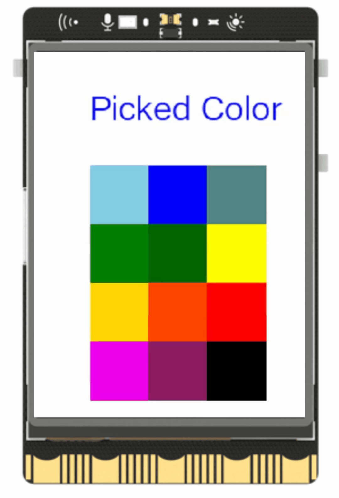

## **Project Introduction**
In this tutorial, we will use the Unihiker GUI library to create an interactive color picker. By clicking on a color, users can choose from various options and see their selected color displayed instantly.  

{width=300, style="display:block;margin: 0 auto"} 

## **Hardware Required**

- [UNIHIKER](https://www.dfrobot.com/product-2691.html)
## **Code** 
The objective of this project is to create a simple GUI interface where users can click on different color squares to modify the color of a displayed text on the screen.   

To begin, we import the GUI library and instantiate a GUI object. Next, a text label is created to serve as the color indicator, with a default color set initially.   

Then, an array of squares is generated using the fill_rect() function, with each square assigned a unique color and clickable action.   

The lambda function is used within the fill_rect() function to create a temporary function that updates the text color to match the clicked square. A loop with time.sleep(1) is used to keep the program running and allow users to use the drawing feature without the program ending too quickly.  

```python
from unihiker import GUI  
import time
gui=GUI()  #Instantiate a GUI object.
Text = gui.draw_text(text='Picked Color',x=50,y=30,font_size=20)
Text.config(color='#0000FF')
gui.fill_rect(x=50, y=100, w=50, h=50,color="skyblue",onclick=lambda:Text.config(color='skyblue'))
gui.fill_rect(x=100, y=100, w=50, h=50,color="blue",onclick=lambda:Text.config(color='blue'))
gui.fill_rect(x=150, y=100, w=50, h=50,color="CadetBlue4",onclick=lambda:Text.config(color='CadetBlue4'))
gui.fill_rect(x=50, y=150, w=50, h=50,color="green",onclick=lambda:Text.config(color='green'))
gui.fill_rect(x=100, y=150, w=50, h=50,color="dark green",onclick=lambda:Text.config(color='dark green'))
gui.fill_rect(x=150, y=150, w=50, h=50,color="yellow",onclick=lambda:Text.config(color='yellow'))
gui.fill_rect(x=50, y=200, w=50, h=50,color="gold",onclick=lambda:Text.config(color='gold'))
gui.fill_rect(x=100, y=200, w=50, h=50,color="orange red",onclick=lambda:Text.config(color='orange red'))
gui.fill_rect(x=150, y=200, w=50, h=50,color="red",onclick=lambda:Text.config(color='red'))
gui.fill_rect(x=50, y=250, w=50, h=50,color="magenta2",onclick=lambda:Text.config(color='magenta2'))
gui.fill_rect(x=100, y=250, w=50, h=50,color="maroon4",onclick=lambda:Text.config(color='maroon4'))
gui.fill_rect(x=150, y=250, w=50, h=50,color="black",onclick=lambda:Text.config(color='black'))
while True:
   #Prevent the program from exiting or getting stuck
    time.sleep(1)
```  
  
## **Demo Effect**
{width=300, style="display:block;margin: 0 auto"}

---  

