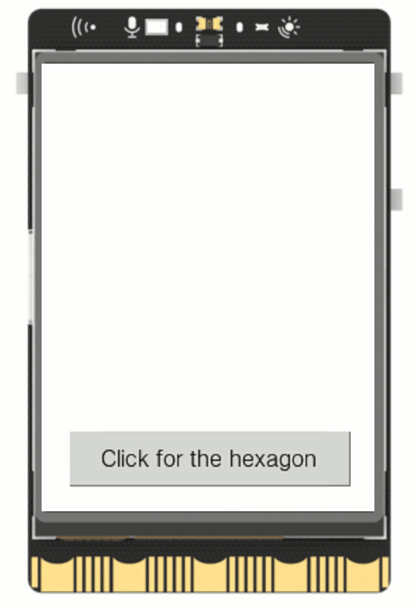

## **Project Introduction**
By utilizing the screen display function of UNIHIKER, it is possible to achieve a polygonal display effect and create a polygonal display.   
This project primarily utilizes the draw_line() function to implement the drawing of polygons and provides a better demonstration of the capabilities of the screen click and line drawing functions for educational purposes.  

{width=300, style="display:block;margin: 0 auto"} 

## **Hardware Required**

- [UNIHIKER](https://www.dfrobot.com/product-2691.html)
## **Code**
To display a hexagonal shape on the UNIHIKER screen, we first need to create an object using the GUI() class.   

Then, a button is added to this object.   

Finally, a state variable "step" is set in the callback function of the button, so that each time the button is pressed, the step increases by 1.    

As a result, the hexagon will be gradually drawn on the screen, and the terminal will prompt for the button to be continuously clicked.  

```python
from unihiker import GUI

# button callback
def button_click1():
    global step

    if (step == 0):
        line1=gui.draw_line(x0=90,y0=108,x1=150,y1=108,width=1,color="#0000FF")
        step = (step + 1)
        print("Please click to draw new line")
    elif (step == 1):
        line2=gui.draw_line(x0=150,y0=108,x1=180,y1=160,width=1,color="#0000FF")
        step = (step + 1)
        print("Please click to draw new line")
    elif (step == 2):
        line3=gui.draw_line(x0=180,y0=160,x1=150,y1=212,width=1,color="#0000FF")
        step = (step + 1)
        print("Please click to draw new line")
    elif (step == 3):
        line4=gui.draw_line(x0=150,y0=212,x1=90,y1=212,width=1,color="#0000FF")
        step = (step + 1)
        print("Please click to draw new line")
    elif (step == 4):
        line5=gui.draw_line(x0=90,y0=212,x1=60,y1=160,width=1,color="#0000FF")
        step = (step + 1)
        print("Please click to draw new line")
    elif (step == 5):
        line6=gui.draw_line(x0=60,y0=160,x1=90,y1=108,width=1,color="#0000FF")
        step = 6
        print("Please click to delete")

gui = GUI()
Hex = gui.add_button(text="Click for the hexagon",x=20,y=260,w=200,h=40,onclick=button_click1)
step = 0

while True:
    pass
```
## **Demo Effect**
{width=300, style="display:block;margin: 0 auto"}  

---  


