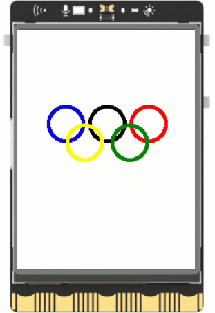
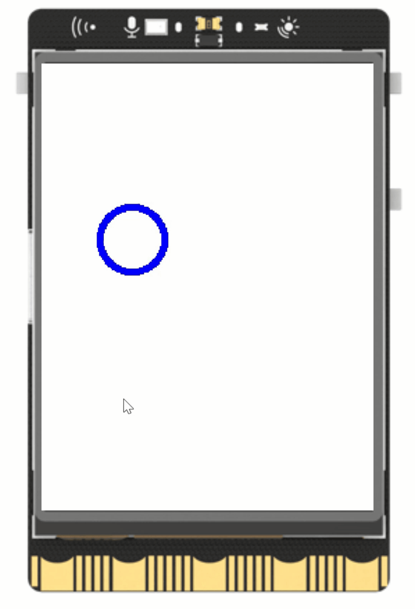
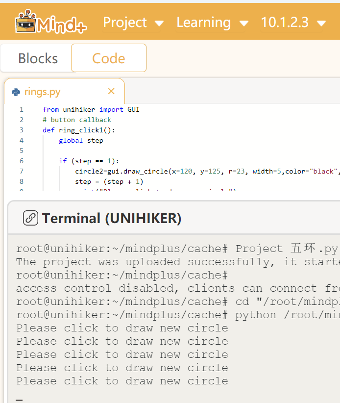

## **Project Introduction**
In this project, we will be creating the Olympic Rings, an iconic symbol consisting of 5 different colored rings. The draw_circle function from the GUI class will be utilized to showcase how to create these graphical elements and combine them to form the image.  
  
{width=300, style="display:block;margin: 0 auto"}  

## **Hardware Required**

- [UNIHIKER](https://www.dfrobot.com/product-2691.html)
## **Code**

In this interactive example, users can create the five Olympic Rings using the draw_circle function from the Unihiker GUI library. The process begins with a single blue ring, and with each subsequent user click, another ring is added until all rings are displayed. A prompt in the terminal, "Please click to draw a new circle," guides the user through each step.  

The initial blue ring has a radius of 23 and a line width of 5, positioned at coordinates (65, 125). The onclick attribute, as shown in line 24 of the code snippet, is assigned a callback function, ring_click1, defined at line 3. This function tracks the number of rings clicked and generates the next ring in its specified location.  

As the interaction progresses, subsequent rings are drawn: a black ring at (120, 125), followed by a red ring at (175, 125), a yellow ring at (90, 150), and finally, a green ring at (150, 150). To ensure users can observe and interact with each step, a loop incorporating time.sleep(1) maintains program execution without ending prematurely.


```python
from unihiker import GUI
# button callback function
def ring_click1():
    global step
    
    if (step == 1):
        circle2=gui.draw_circle(x=120, y=125, r=23, width=5,color="black",onclick=ring_click1)
        step = (step + 1)
        print("Please click to draw a new circle")
    elif (step == 2):
        circle3=gui.draw_circle(x=175, y=125, r=23, width=5,color="red",onclick=ring_click1)
        step = (step + 1)
        print("Please click to draw a new circle")
    elif (step == 3):
        circle4=gui.draw_circle(x=90, y=150, r=23, width=5,color="yellow",onclick=ring_click1)
        step = (step + 1)
        print("Please click to draw a new circle")
    elif (step == 4):
        circle5=gui.draw_circle(x=150, y=150, r=23, width=5,color="green",onclick=ring_click1)
        step = (step + 1)
        print("Please click to draw a new circle")
        
gui = GUI()
circle1=gui.draw_circle(x=65, y=125, r=23, width=5,color="blue",onclick=ring_click1)
# Draw the first circle, set
print("Please click to draw a new circle")
step = 1

while True:
    pass

```
## **Demo Effect**

{width=300, style="display:block;margin: 0 auto"}   

{width=500, style="display:block;margin: 0 auto"}  

---  


