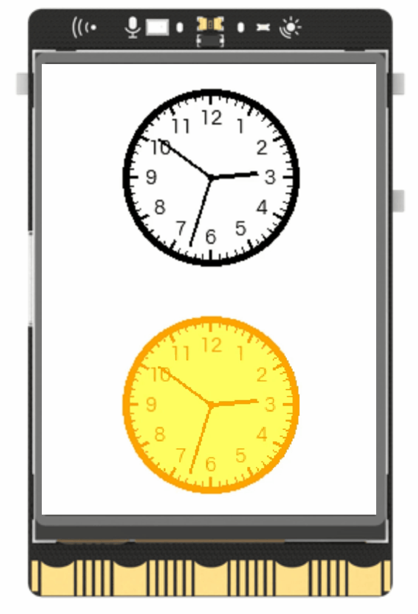

## **Project Introduction**
Using the screen display function of the line air board, it is possible to create an analog clock and a desktop clock. This project primarily utilizes the draw_clock() and fill_clock() functions to implement the analog clock display, providing a better demonstration of the capabilities of the draw_clock() function for educational purposes.  

{width=300, style="display:block;margin: 0 auto"} 

## **Hardware Required**

- [UNIHIKER](https://www.dfrobot.com/product-2691.html)  

## **Code**

Use draw_clock() and fill_clock() to draw two clocks, then use config() to update the time, the time comes from the system time of UNIHIKER.  
>Note: UNIHIKER will automatically obtain the NTP time after connecting to the network. If the time zone does not match the current one, you need to adjust the time zone settings.

```python
from unihiker import GUI
import time
import datetime

#Instantiate a GUI object.
gui = GUI() 

#Create a clock and set color/size
clk1 = gui.draw_clock(x=120, y=80, r=60, h=10, m=8, s=0, color="#000000")
clk2 = gui.fill_clock(x=120, y=240, r=60, h=10, m=8, s=0, color="#FFA500", fill="#FFFF66")

while True:
    #System time is automatically calibrated after connecting to the internet.
    clk1.config(h=datetime.datetime.now().hour,m=datetime.datetime.now().minute,s=datetime.datetime.now().second)
    clk2.config(h=datetime.datetime.now().hour,m=datetime.datetime.now().minute,s=datetime.datetime.now().second)

    time.sleep(1)
```
## **Demo effect** 
{width=300, style="display:block;margin: 0 auto"}  

---  


