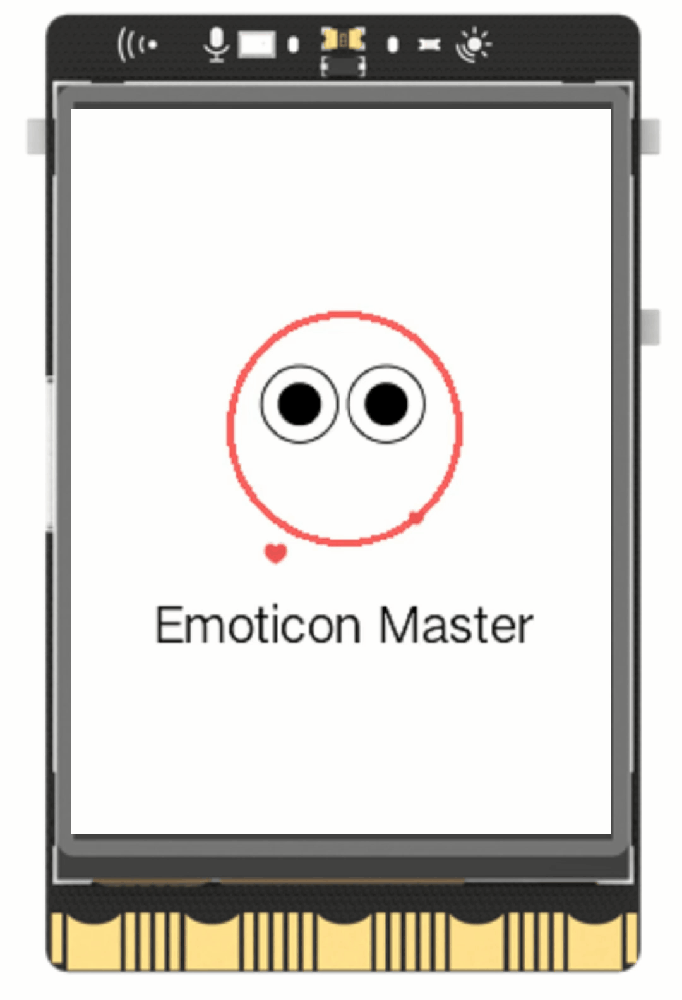

## **Project Introduction**
This project uses the GUI class from the UNIHIKER library and utilizes the draw_emoji() function to generate emotion emoji images. In the following two examples, the callback() function is utilized to change the emotion emoji on the screen after clicking the corresponding buttons. Below is an example showcasing the "Wink" emoji on the UNIHIKER screen.
{width=300, style="display:block;margin: 0 auto"} 

## **Hardware Required**

- [UNIHIKER](https://www.dfrobot.com/product-2691.html)  

## **Code**

To display a winking emoji on the UNIHIKER screen, begin by using the instantiated GUI object to invoke the draw_circle() function and create a circle. Subsequently, call the draw_emoji() function to place the winking emoji inside the circle.  


```python
from unihiker import GUI

#Instantiate a GUI object.
gui = GUI() 

#Create a circle and set color/size
circle = gui.draw_circle(x = 120,y = 140,r = 50,width = 3,color = "#FF6666") 

#Create a wink emoji and set size
emj = gui.draw_emoji(emoji = "Wink",x = 120,y = 140,duration = 0.2) 

#set the origin point as the center of the emoji
emj.config(origin = "center") 

#set the width of the emoji as 100
emj.config(w = 100) 

#Draw a text
Text = gui.draw_text(text = "Emoticon Master",x = 120,y = 210,font_size = 15, color = "#000000")

#Set the origin point as the top of the text
Text.config(origin = "top") 

while True:
    pass
```
## **Demo Effect**  

{width=300, style="display:block;margin: 0 auto"}  

---  


