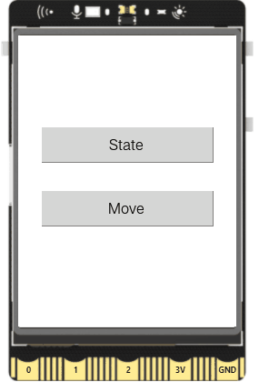

## **Project Introduction**
In this project, use the add_button function of the GUI class to demonstrate creating buttons on the Unihiker touch screen, and use the config function to update button status and move button position.

{width=300, style="display:block;margin: 0 auto"}   


## **Hardware Required**

- [UNIHIKER](https://www.dfrobot.com/product-2691.html)  

## **Code** 

In this example, two buttons are created using the add_button function. Each button is assigned its own callback functions "A" and "B". In function "A", each call flips the status of button B, updates the text and resets the button position. In function "B", button B is moved off the screen to achieve a temporary hiding effect.

```python
from unihiker import GUI
import time

#Instantiate a GUI object.
u_gui=GUI()

#Variable
button_state = "normal"

# Callback function
def A():
    global button_state
    if button_state == "normal":
        button_state = "disabled"
    else:
        button_state = "normal"

    #Move the button off the screen
    buttonB.config(x=25,text="BtnA is Clicked",state=button_state)

def B():
    #Move the button off the screen
    buttonB.config(x=240)

#Create buttons with text; set their size, location and callback functions 
buttonA = u_gui.add_button(text="State",x=25,y=100,w=190,h=40,onclick=A)
buttonB = u_gui.add_button(text="Move",x=25,y=170,w=190,h=40,onclick=B)
while True:

    #Prevent the program from exiting or getting stuck
    time.sleep(0.1)
```  

## **Demo Effect**
{width=300, style="display:block;margin: 0 auto"}  

---  


