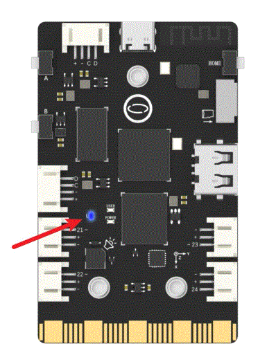

## **Project Introduction**
UNIHIKER is equipped with a microcontroller responsible for controlling onboard components and GPIO. Based on this functionality, we can control the onboard LED of UNIHIKER to flash. This project uses the Pin(Pin.P25, Pin.OUT).write_digital(signal) method of in the PinPong library of Python to control a blue LED (marked as L) located on the back of the board.
Below is an example of controlling the LED to flash.  

{width=300, style="display:block;margin: 0 auto"}  


## **Hardware Required**

- [UNIHIKER](https://www.dfrobot.com/product-2691.html)  

## **Code**
In this example, begin by initializing UNIHIKER with Board().begin(). Next, configure the pin assigned to the L LED as a digital output using Pin(Pin.P25, Pin.OUT). Within the main loop, utilize the value(1) or write_digital(1) method of the L LED object to set the output to high, maintaining it for 1 second. Subsequently, use the value(0) or write_digital(0) method to set the output to low for another 1 second. This sequence enables the microcontroller on UNIHIKER to control the onboard LED, causing it to flash intermittently.  

```python
#  -*- coding: UTF-8 -*-

# MindPlus
# Python
from pinpong.board import Board,Pin
import time

# initialization
Board().begin()

# The pin is initialized to level output mode, and P25 is the pin of the L light
led = Pin(Pin.P25, Pin.OUT)

while True:
    # output high level voltage
    # led.value(1)		# Method 1
    led.write_digital(1)	# Method 2
    print("on")
    time.sleep(1)

    # output low level voltage
    # led.value(0)		# Method 1
    led.write_digital(0)	# Method 2
    print("off")
    time.sleep(1)
```  

## **Demo Effect**

{width=300, style="display:block;margin: 0 auto"}  

---  


