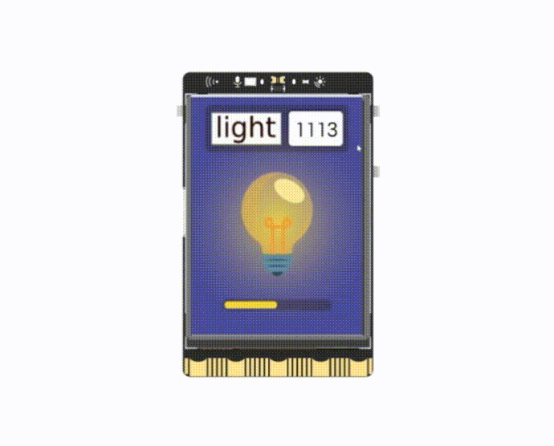

## **Project Introduction**
UNIHIKER is equipped with a light sensor positioned above the front screen, enabling detection of ambient light intensity. Leveraging this capability, a luminosity detector can be developed. This project involves displaying the light value detected by the sensor on the screen. Furthermore, the ambient light intensity is categorized into four levels on average, with varying brightness levels of small lamp background images displayed according to different light conditions. Below is an illustration of the luminosity detector in action.  

![1721617426985[00h00m00s-00h00m10s].gif](img/17.Luminosity detector/1721617488232-be48c0d5-1044-4356-be58-814674ddb4b1.gif)   


## **Hardware Required**

- [UNIHIKER](https://www.dfrobot.com/product-2691.html)  

## **Code**
In this example, UNIHIKER is initialized with Board().begin(). Then, a GUI object is instantiated and an image object and a text object are created using the draw_image() and draw_text() methods, respectively. In the main loop, the intensity of ambient light is obtained using the light.read() method from the PinPong library, and the light value is displayed on the screen using the draw_text() method from the GUI library. Additionally, the ambient light intensity is divided into four levels on average, and different brightness levels of small lamp background images are displayed on the screen using the draw_image() method from the GUI library under different light conditions.  

> Note: Put the photo materials in the same directory as this code.  

```python 
from unihiker import GUI
import time

from pinpong.board import Board 
from pinpong.extension.unihiker import *

# # initialization
Board().begin()

# Instantiate a GUI object
gui = GUI()
img = gui.draw_image(x=0,y=0,w=240, h=320, image='light-1.png')
value = gui.draw_text(x=145, y=28, text='0', font_size=18)

while True :
    # Update the displayed light value
    Light = light.read()
    value.config(text = Light)
    
    # Light value level
    if Light < 1024:
        img.config(image='light-2.png')
    elif 1024 <= Light < 2048:
        img.config(image='light-3.png')
    elif 2048 <= Light < 3072:
        img.config(image='light-4.png')
    else:
        img.config(image='light-5.png')

    time.sleep(1)
```  


## **Demo Effect**
  


---  


