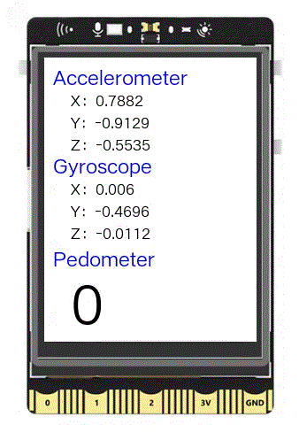

## **Project Introduction**

The UNIHIKER also comes with a 6-axis accelerometer and gyroscope sensor, which can read the x, y, and z values of the accelerometer and gyroscope individually. This feature can be utilized to create a pedometer, where the values of the accelerometer and gyroscope are displayed on the screen, and the number of steps is calculated and displayed based on the acceleration intensity. Below is an example of a pedometer.   

{width=300, style="display:block;margin: 0 auto"}   


## **Hardware Required**

- [UNIHIKER](https://www.dfrobot.com/product-2691.html)  

## **Code**
In this example, the UNIHIKER is initialized using the Board().begin() function, and a GUI object is instantiated. Then, using the draw_text() method, multiple text objects are created to display the acceleration, gyroscope, and step count values, along with their corresponding values.   

The main program utilizes accelerometer.get_x(), accelerometer.get_y(), and accelerometer.get_z() to obtain the x, y, and z values of the acceleration, and gyroscope.get_x(), gyroscope.get_y(), and gyroscope.get_z() for the x, y, and z values of the gyroscope. These values are then displayed on the screen using the config() method of the text object.   

Additionally, the step count is calculated using accelerometer.get_strength() and incremented by 1 when the acceleration intensity value exceeds 1.5. The step count is also displayed on the screen using the config() method of the text object.  

```python
#  -*- coding: UTF-8 -*-

# MindPlus
# Python
from pinpong.extension.unihiker import *
from pinpong.board import Board,Pin
from unihiker import GUI
import time

value = 0

Board().begin()

# Instantiate object
gui = GUI()
gui.draw_text(text="Accelerometer",x=10,y=5,font_size=16, color="#0000FF")
gui.draw_text(text="Gyroscope",x=10,y=105,font_size=16, color="#0000FF")
gui.draw_text(text="Pedometer",x=10,y=210,font_size=16, color="#0000FF")
accelerometer_x = gui.draw_text(text="X：",x=30,y=35,font_size=12, color="#000000")
accelerometer_y = gui.draw_text(text="Y：",x=30,y=60,font_size=12, color="#000000")
accelerometer_z = gui.draw_text(text="Z：",x=30,y=85,font_size=12, color="#000000")
gyroscope_x = gui.draw_text(text="X：",x=30,y=135,font_size=12, color="#000000")
gyroscope_y = gui.draw_text(text="Y：",x=30,y=160,font_size=12, color="#000000")
gyroscope_z = gui.draw_text(text="Z：",x=30,y=185,font_size=12, color="#000000")
pedometer=gui.draw_text(text=value,x=30,y=230,font_size=45, color="#000000")

while True:
    # Update value
    accelerometer_x.config(text=(str("X：") + str(accelerometer.get_x())))
    accelerometer_y.config(text=(str("Y：") + str(accelerometer.get_y())))
    accelerometer_z.config(text=(str("Z：") + str(accelerometer.get_z())))
    gyroscope_x.config(text=(str("X：") + str(gyroscope.get_x())))
    gyroscope_y.config(text=(str("Y：") + str(gyroscope.get_y())))
    gyroscope_z.config(text=(str("Z：") + str(gyroscope.get_z())))
    
    # Step count
    if (accelerometer.get_strength() > 1.5):
        value = (value + 1)
        pedometer.config(text=value)
    time.sleep(0.1)
```  

## **Demo Effect**

{width=300, style="display:block;margin: 0 auto"}   


---  


