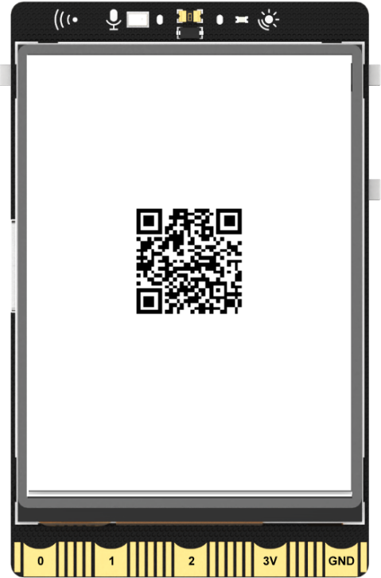

## **Project Introduction**
Utilizing the screen display function of UNIHIKER, it is possible to generate and display a QR code. This project primarily utilizes the draw_qr_code() function to implement the display of a QR code on the UNIHIKER screen. The QR code in this project links to UNIHIKER's wiki, providing a better demonstration of the capabilities of the draw_qr_code() function for educational purposes.  

{width=300, style="display:block;margin: 0 auto"}   

## **Hardware Required**

- [UNIHIKER](https://www.dfrobot.com/product-2691.html)  

## **Code**
In order to display a QR code on the UNIHIKER screen, the instantiated GUI object should be used to call the draw_qr_code() function and the desired URL should be filled in as the text parameter.  

```python
from unihiker import GUI

u_gui=GUI()
QR=u_gui.draw_qr_code(text="https://www.unihiker.com/wiki/",x=70,y=100,w=100)

while True:
    pass
```  

## **Demo Effect**
{width=300, style="display:block;margin: 0 auto"}  

---  


