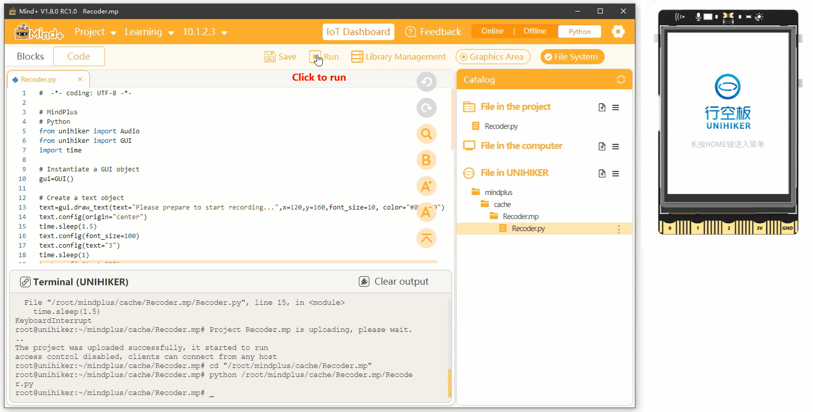

## **Project Introduction**
The recording feature of UNIHIKER allows for the creation of a voice recorder. There are two ways to implement this project. The first method involves using the record(file, duration) method of the Audio() class in the UNIHIKER library to record audio for a specified duration and save it. The second method involves using the start_record(file) method of the Audio() class to start recording and then using the stop_record() method to stop the recording. Additionally, the draw_text() method of the GUI() class can be used to create a recording animation effect. The following is an example to demonstrate the effect of implementing a recorder.  

   


## **Hardware Required**

- [UNIHIKER](https://www.dfrobot.com/product-2691.html)  

## **Code 1**

To create a voice recorder, first create a GUI instantiation object. Then, use the draw_text() method of the GUI object to create a text object, including parameters such as the text content, coordinates, text size, color, and alignment. Next, use the config() method of the text object to update the text content, font size, and other parameters to achieve the recorder animation effect. Finally, create an Audio instantiation object and use the record(file, duration) method to define the recording duration and save the audio file.  


!!! note
    Once the recording is completed, you can open the computer to view the audio file for playback. Simply refresh the directory and you will find that the audio file is in the same directory as the program. This allows for easy access to the recorded audio file for playback or further use.  

```python
#  -*- coding: UTF-8 -*-

# MindPlus
# Python
from unihiker import Audio
from unihiker import GUI
import time

# Instantiate a GUI object
gui=GUI()

# Instantiate a Audio object
audio = Audio()

# Create a text object
text=gui.draw_text(text="Please prepare to start recording...",x=120,y=160,font_size=10, color="#000000",origin="center")
time.sleep(1.5)
text.config(text="3",font_size=100)
time.sleep(1)
text.config(text="2")
time.sleep(1)
text.config(text="1")
time.sleep(1)
text.config(text="recording",font_size=15)

# Record 3 seconds
audio.record("hello.wav",3)

text.config(text="Recording completion")
time.sleep(1.5)
```
## **Code 2**
To create a voice recorder, first create a GUI instantiation object. Then, use the draw_text() method of the GUI object to create a text object, including parameters such as the text content, coordinates, text size, color, and alignment. Next, use the config() method of the text object to update the text content, font size, and other parameters to achieve the recorder animation effect. Finally, create an Audio instantiation object, start recording with the start_record(file) method, use time.sleep() to specify the recording duration, and end the recording with the stop_record() method of the Audio() object.  

!!! note
    After the recording is completed, you can open the computer to view the audio file for playback.  

```python
#  -*- coding: UTF-8 -*-

# MindPlus
# Python
from unihiker import Audio
from unihiker import GUI
import time

# Instantiate a GUI object
gui=GUI()

# Instantiate a Audio object
audio = Audio()

# Create a text object
text=gui.draw_text(text="Please prepare to start recording...",x=120,y=160,font_size=10, color="#000000",origin="center")
time.sleep(1.5)
text.config(text="3",font_size=100)
time.sleep(1)
text.config(text="2")
time.sleep(1)
text.config(text="1")
time.sleep(1)
text.config(text="recording",font_size=15)

# Start recording
audio.start_record("hello.wav")
time.sleep(3)

# Stop recording
audio.stop_record()

text.config(text="Recording completion")
time.sleep(2)
```  

## **Demo Effect**
  


---  


