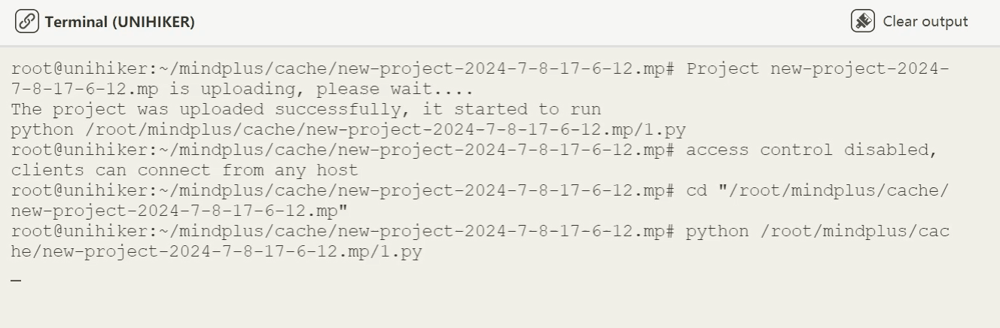

## **Project Introduction**
This project utilizes UNIHIKER to display specified images on top of UNIHIKER, allowing for the creation of a small display. The main goal of this project is to showcase the display of a starry sky image in UNIHIKER using the draw_image() function, providing a better demonstration of the capabilities of the image display function for educational purposes.  

{width=300, style="display:block;margin: 0 auto"}   

## **Hardware Required**

- [UNIHIKER](https://www.dfrobot.com/product-2691.html)  

## **Code**

In this example, we first instantiate an object using the GUI() class. Then, this object is passed to the draw_image() function along with the "Galaxy.png" image. Additionally, a print() function is bound to this object using a callback function. 
> It is important to note: 
> The background image must be named "Galaxy.png" and should be located in the same directory as this code.  

```python
from unihiker import GUI

# Callback function
def screen_click1():
    print("image clicked")

u_gui=GUI()
Screen = u_gui.draw_image(image="Galaxy.png",x=0,y=0,onclick=screen_click1)

while True:
    pass
```  

## **Demo Effect**

{width=300, style="display:block;margin: 0 auto"}  

{style="display:block;margin: 0 auto"}  

---  


