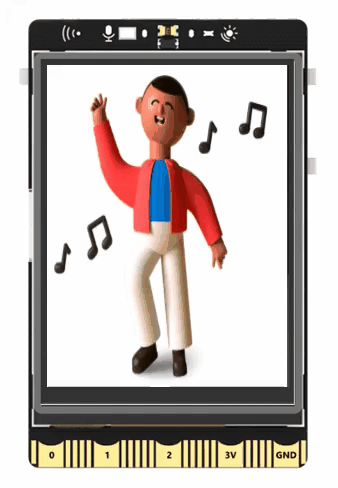
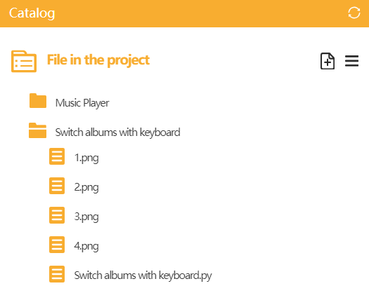

## **Project Introduction**
The keyboard detection feature of UNIHIKER enables us to retrieve the state of keys pressed on the keyboard. This allows for the creation of a photo album that can switch photos by pressing keys. The project primarily uses the on_key_click(callback function name) method from the GUI() class in the UNIHIKER library to monitor keyboard click events. When a user presses a key on the keyboard, the system triggers this method and executes the event handling function associated with the key. Within this function, the draw_image() method of the GUI() class can be used to update the photo. The A and B keys on UNIHIKER are mapped to the AB key on the keyboard. The following example demonstrates how to switch photos by pressing the A and B keys.  

{width=300, style="display:block;margin: 0 auto"}   


## **Hardware Required**

- [UNIHIKER](https://www.dfrobot.com/product-2691.html)  

## **Code**
To create a photo album that switches photos by pressing keys, first create an instance of the GUI by instantiating the GUI object. Then, use the draw_image() method of the GUI object to create an image object as the initial screen, including parameters such as the image source and coordinates.  

Next, define two callback functions to handle the click events of keys A and B. Within these callback functions, use mathematical operations to increment and decrement the image index. Use the config() method of the image object to update the image source, passing it as a combination of the variable "img_num" and ".png". Finally, use the on_a_click(callback function name) and on_b_click(callback function name) methods of the GUI object to monitor the click events of keys A and B, respectively, and bind them to the event handling functions. This will allow for switching photos by pressing the A and B keys on UNIHIKER.  

!!! note
    · The photo assets must be named in the format "number.png" and placed in the same directory as this code.
  
    {width=400, style="display:block;margin: 0 auto"}   

    
```python
#  -*- coding: UTF-8 -*-

# MindPlus
# Python
from unihiker import GUI
import time

# Instantiate a GUI object
gui=GUI()

# Create a picture object
img_num = 1
img=gui.draw_image(image=(str(img_num) + str(".png")),x=0,y=0)

# Event callback function
def on_buttona_click_callback():
    global img_num
    img_num -= 1
    if (img_num < 1):
        img_num = 4
    img.config(image=(str(img_num) + str(".png")))

# Event callback function
def on_buttonb_click_callback():
    global img_num
    img_num += 1
    if (img_num > 4):
        img_num = 1
    img.config(image=(str(img_num) + str(".png")))


# Monitor keyboard click events
gui.on_a_click(on_buttona_click_callback)
gui.on_b_click(on_buttonb_click_callback)

while True:
    # Increased wait to prevent program exit and jamming
    time.sleep(1)

```  

## **Demo Effect**
{width=300, style="display:block;margin: 0 auto"}  

---  


 
 
