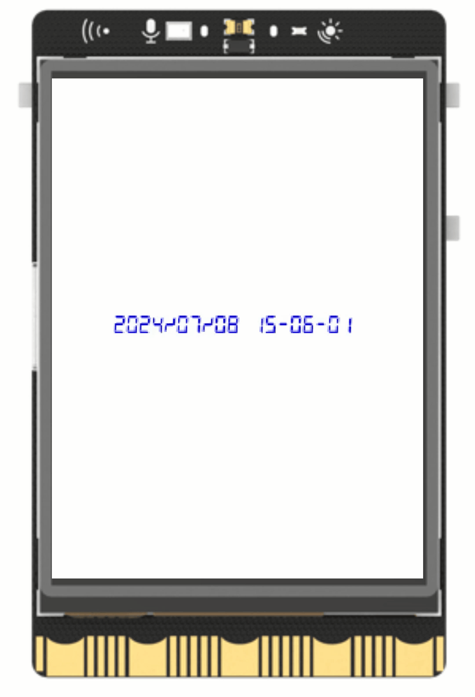

## **Project Introduction**
Using UNIHIKER's digital font display function, it is possible to showcase digital text and other effects, such as creating a desktop clock. This project primarily utilizes the 'GUI()' class and 'draw_digit()' function to display the time in digital font, providing a better demonstration of the capabilities of the digital font text display function for educational purposes.  

{width=300 style="display:block;margin: 0 auto"}    

## **Hardware Required**

- [UNIHIKER](https://www.dfrobot.com/product-2691.html)  

## **Code**
In order to display a simulated digital clock on the screen using the UNIHIKER library, the initial step is to create a GUI object. Then, the draw_digit() function of the GUI object is used to generate a text object, with the strftime() function from the time library (which is a function of the Time class used to format the current time) passed as the text parameter in draw_digit(). This text object is continuously refreshed in a while True loop using the config() function, where the text parameter of the config() function is set to strftime.  

> Tips: Once connected to the network with UNIHIKER, the system time will automatically synchronize with the network.  

```python
from unihiker import GUI
import time


gui=GUI()
DigitalTime=gui.draw_digit(text=time.strftime("%Y/%m/%d %H:%M:%S"),x=40,y=150,font_size=10, color="#0000FF")

while True:
    DigitalTime.config(text=time.strftime("%Y/%m/%d %H:%M:%S"))
```  

## **Demo Effect**
 
{width=300 style="display:block;margin: 0 auto"}  


---  


