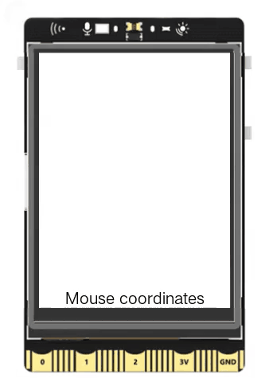

## **Project Introduction**
The keyboard detection feature of UNIHIKER allows us to detect key presses on the keyboard. This feature can be utilized to create a photo album that can scroll through photos by pressing different keys.   

This project primarily utilizes the on_mouse_move(callback function name) method from the GUI() class in the UNIHIKER library to handle mouse movement events. When a user moves the mouse on the GUI interface, this method is triggered by the system, allowing us to retrieve the mouse coordinates. The draw_text() method of the GUI() class is then used to display the mouse coordinates on the screen.   

Below is an example showcasing this process of locating the mouse position.  

{width=300, style="display:block;margin: 0 auto"}     

## **Hardware Required**

- [UNIHIKER](https://www.dfrobot.com/product-2691.html)  

## **Code**
In order to use the UNIHIKER library to retrieve and display mouse coordinates on the screen, there are two parts to consider.   

The first part is for interface display. Firstly, an instance of the GUI object must be created. Then, the draw_text() method of the GUI object can be used to generate a text object that displays the mouse coordinates, including parameters such as the specific content of the text and its coordinates.  

The second part is for obtaining the mouse coordinates. Firstly, a callback function must be defined to handle mouse movement events. Within this function, the config() method of the text object can be used to update the mouse coordinates in the screen text content. Then, the on_mouse_move(callback function name) method of the GUI object can be utilized to capture mouse movement events and bind them to the event handling function.  

!!! note
    It is also possible to control mouse movement by plugging a mouse into the Type-A port of UNIHIKER.  

```python
from unihiker import GUI  

# Instantiate a GUI object
gui=GUI() 

# Creates a text object
info_text = gui.draw_text(x=120, y=320, text='Mouse coordinates',origin='bottom')

# Callback function
def mouse_move(x, y):
    info_text.config(text="coordinate:x={},y={}".format(x, y))
    print(x,y)

# Capture mouse movement events
gui.on_mouse_move(mouse_move)

import time
while True:
    # Increased wait to prevent program exit and jamming
    time.sleep(1)
```  

## **Demo Effect**
{width=300, style="display:block;margin: 0 auto"}  

---  


