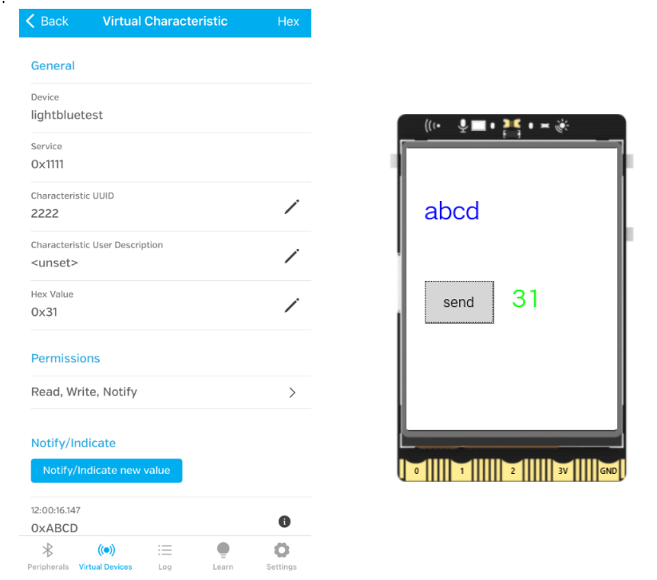
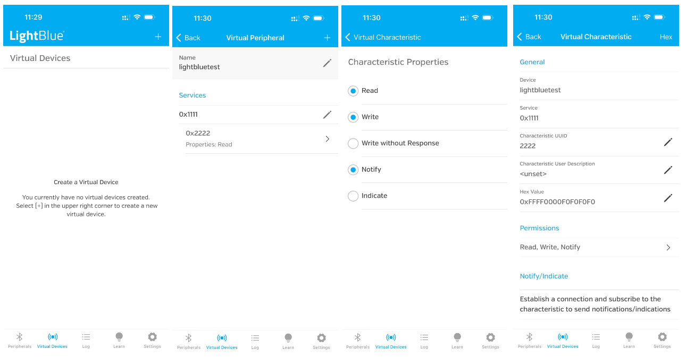
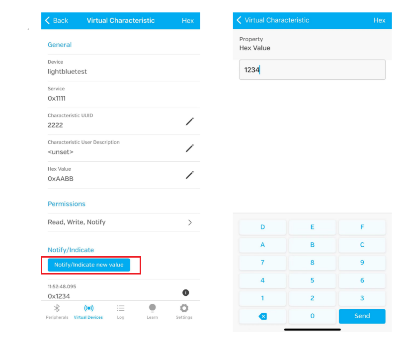
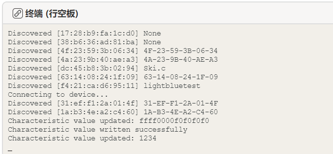

## **Project Introduction**
UNIHIKER supports Bluetooth functionality, as do most smartphones, so UNIHIKER can communicate with the phone.

In this case, we use the lightblue app on the phone to demonstrate communication with UNIHIKER. We enable a BLE Server in the lightblue app, and UNIHIKER uses the gatt library for bidirectional communication.

Through this case, you can also try to use other apps that support BLE functionality or create your own app to communicate with UNIHIKER.

{width=700, style="display:block;margin: 0 auto"}   

## **Hardware Required**

- [UNIHIKER](https://www.dfrobot.com/product-2691.html) x 1
- iPhone

## **Software Required**
Install the LightBlue software from the app store and open it. In the software, select "Virtual Devices">"+">"Blank" device, set the Name as "lightbluetest", and check Read, Write, Notify in Permissions.  




## **Code 1**


```python
#  -*- coding: UTF-8 -*-
import gatt
import binascii

#Replace the following information with the information of the Virtual Devices you created in your lightblue software.
ble_name = "lightbluetest" #The MAC address and name only need one to be correct.
ble_mac = "f4:21:ca:d6:95:11"
ble_service_uuid = '00001111-0000-1000-8000-00805f9b34fb' 
ble_characteristic_uuid = '00002222-0000-1000-8000-00805f9b34fb'

# Define a custom DeviceManager class
class AnyDeviceManager(gatt.DeviceManager):
    # This method is called whenever a device is discovered
    def device_discovered(self, device):
        print("Discovered [%s] %s" % (device.mac_address, device.alias()))
        # If the discovered device is the one we're looking for, stop discovery and connect
        if device.alias() == ble_name or device.mac_address.lower() == ble_mac.lower() : 
            print("Connecting to device...")
            self.stop_discovery()
            device.connect()

    # This method creates a new instance of the custom Device class
    def make_device(self, mac_address):
        return AnyDevice(mac_address=mac_address, manager=self)

# Define a custom Device class
class AnyDevice(gatt.Device):
    # This method is called when the BLE services of the device have been resolved
    def services_resolved(self):
        super().services_resolved()

        # Find the service with the specified UUID
        device_information_service = next(
            s for s in self.services
            if s.uuid == ble_service_uuid) 

        # Find the characteristic with the specified UUID
        characteristic = next(
            c for c in device_information_service.characteristics
            if c.uuid == ble_characteristic_uuid) 

        # Read the value of the characteristic
        characteristic.read_value()
        # Write a value to the characteristic
        characteristic.write_value(bytearray([0xaa, 0xbb]))
        # Enable notifications for the characteristic
        characteristic.enable_notifications()

    # This method is called when the value of a characteristic is updated
    def characteristic_value_updated(self, characteristic, value):
        hex_value = binascii.hexlify(value).decode('utf-8')
        print("Characteristic value updated:", hex_value)

    # This method is called when a write operation to a characteristic has succeeded
    def characteristic_write_value_succeeded(self, characteristic):
        print("Characteristic value written successfully")

    # This method writes a value to a characteristic
    def write_characteristic_value(self, characteristic, value):
        characteristic.write_value(value)

# Create an instance of the custom DeviceManager class
manager = AnyDeviceManager(adapter_name='hci0')
# Start the discovery process
manager.start_discovery()
# Run the event loop
manager.run()

```

## **Demo 1 Effect:**
After running the program, the Value on the app side correctly changed to 0xAABB. After clicking on "Notify/Indicate new value" to send a message from the app side, UNIHIKER correctly received 1234.  
{width=600, style="display:block;margin: 0 auto"}      
{width=600, style="display:block;margin: 0 auto"}          


## **Code 2**

The second segment of code uses the UNIHIKER library as the GUI interface, placing BLE communication into the thread to achieve interaction between the UNIHIKER screen and the mobile app.

```python
#  -*- coding: UTF-8 -*-

import gatt
import binascii
import random
from unihiker import GUI
import threading

recv_value = ""
characteristic_to_write = None

#Replace the following information with the information of the Virtual Devices you created in your lightblue software.
ble_name = "lightbluetest" #The MAC address and name only need one to be correct.
ble_mac = "f4:21:ca:d6:95:11"
# UUIDs for the service and characteristic
ble_service_uuid = '00001111-0000-1000-8000-00805f9b34fb'
ble_characteristic_uuid = '00002222-0000-1000-8000-00805f9b34fb'

# Device manager for discovering and managing any device
class AnyDeviceManager(gatt.DeviceManager):
    def device_discovered(self, device):
        print("Discovered [%s] %s" % (device.mac_address, device.alias()))
        # If the device is the one we're looking for, stop discovery and connect to the device
        if device.alias() == ble_name or device.mac_address.lower() == ble_mac.lower() : 
            print("Connecting to device...")
            self.stop_discovery()
            device.connect()

    def make_device(self, mac_address):
        return AnyDevice(mac_address=mac_address, manager=self)

# Class representing any device
class AnyDevice(gatt.Device):
    def services_resolved(self):
        super().services_resolved()

        # Find the service by its UUID
        device_information_service = next(
            s for s in self.services
            if s.uuid == ble_service_uuid) 

        # Find the characteristic by its UUID
        global characteristic_to_write
        characteristic_to_write = next(
            c for c in device_information_service.characteristics
            if c.uuid == ble_characteristic_uuid) 

        # Read the characteristic's value and enable notifications
        characteristic_to_write.read_value()
        characteristic_to_write.enable_notifications()

    # Callback function when the characteristic's value is updated
    def characteristic_value_updated(self, characteristic, value):
        hex_value = binascii.hexlify(value).decode('utf-8')
        print("Characteristic value updated:", hex_value)
        global recv_value
        recv_value = hex_value

    # Callback function when the characteristic's value is written successfully
    def characteristic_write_value_succeeded(self, characteristic):
        print("Characteristic value written successfully")

# Event callback function
def button_click1():
    print("send message")
    # Generate a random byte array and write it to the characteristic
    value = bytearray([random.randint(0, 255) for _ in range(1)])
    print(value.hex())
    txt2.config(text=str(value.hex()))
    characteristic_to_write.write_value(value)

def run_device_manager():
    # Start the device manager
    manager = AnyDeviceManager(adapter_name='hci0')
    manager.start_discovery()
    manager.run()

# Initialize the UNIHIKER GUI
u_gui=GUI()
txt=u_gui.draw_text(text="test",x=20,y=50,font_size=20, color="#0000FF")

# Add a button to the GUI
bt=u_gui.add_button(text="send",x=20,y=150,w=80,h=50,onclick=button_click1)
txt2=u_gui.draw_text(text="test",x=120,y=150,font_size=20, color="#00FF00")

# Run the device manager in a new thread
threading.Thread(target=run_device_manager).start()

while True:
    # Update the text with the received value
    txt.config(text=recv_value)

```

## **Demo 2 Effect:**
After running the program, click send on the UNIHIKER, a random number will be generated, displayed in green, and sent to the app via BLE. The Value on the app side will display this number. After clicking "Notify/Indicate new value" to send a message from the app side, the content of the message will be displayed in blue text on the UNIHIKER screen.  
{width=700, style="display:block;margin: 0 auto"}   

