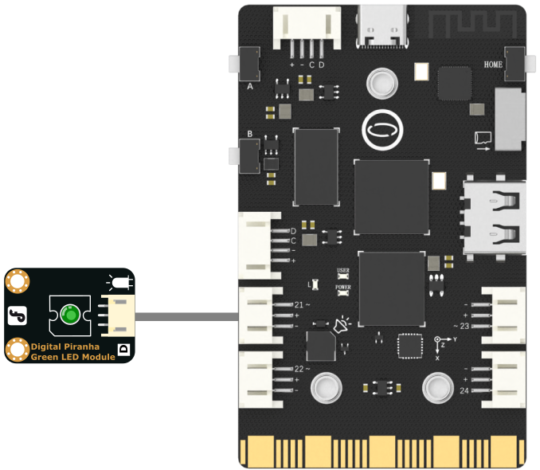

## **Project Introduction**
In this part, we will use PWM method to achieve a blinking LED.
UNIHIKER is equipped with a microcontroller responsible for controlling onboard components and GPIO. Based on this functionality, we can control the external LED by Pin21 which can outputs PWM wave.   

This project uses the duty(value) method in the PinPong library of Python to control a green LED externally connected through side pins of the board.
Here is an example of controlling the LED to blink.
![1-480P[00h00m00s-00h00m08s].gif](img/1_Blinking_LED/1721281953342-11e21fcb-a964-4e9c-b9a7-63b0c799e321.gif)
## **Hardware Required**

- [UNIHIKER](https://www.dfrobot.com/product-2691.html)
- [Gravity: Digital Piranha LED Module - Green](https://www.dfrobot.com/product-632.html)

{width=400, style="display:block;margin: 0 auto"}
## **Code**
In this example, the UNIHIKER is first initialized with Board().begin().   

Then, we use pwm0 = PWM(Pin(Pin.P21)) to initialize the pin, which can output a PWM wave. To change the frequency of the PWM wave, we can use the pwm0.freq(1000) method.   

In the main loop, we use the range() function to generate a loop array and then use the pwm0.duty() function to adjust the PWM duty cycle. To achieve the desired results, two loops can be used to control the gradient of brightness by setting the starting and ending values.
```python
# -*- coding: utf-8 -*-

#Experimental effect: Using PWM wave to control LED breathing light
#Wiring: Use a computer to connect a UNIHIKER, and P21 to connect an LED light module
import time
from pinpong.board import Board,Pin,PWM #Import PWM class to achieve analog output

Board("UNIHIKER").begin()  #Initialize, select board type, do not input board type for automatic recognition
#P0 P2 P3 P8 P9 P10 P16 P21 P22 P23
pwm0 = PWM(Pin(Pin.P21)) #Input Pin into PWM to achieve analog output
#PWM supports a range of 0-1023
pwm0.freq(1000)  #set PWM frequence 
while True:  #loop
    pwm0.duty(0)
    time.sleep(2)
    for i in range(301):  #from 0 to 600
        pwm0.duty(i) 
        print(i) 
        time.sleep(0.02)   #delay 2us
    pwm0.duty(300) 
    time.sleep(2)    
    for i in range(301 , 0, -1):  #from 600 to 0
        pwm0.duty(i)  
        print(i)
        time.sleep(0.02)   #delay 2us 
```
## **Demo Effect**
![1-480P[00h00m00s-00h00m08s].gif](img/1_Blinking_LED/1721281972007-59254163-2790-4cc2-bcaf-d81a791a4d8a.gif)


---
