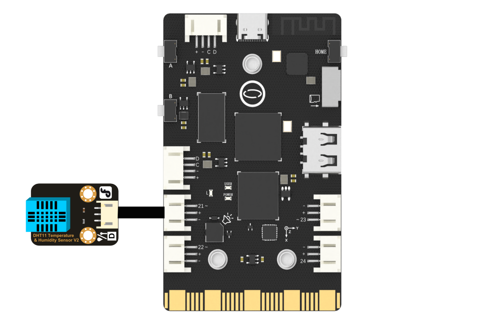

## **Project Introduction**
In this section, we will utilize an external temperature sensor to monitor the temperature. When the temperature exceeds a certain value, an alarm will be triggered by the buzzer.
UNIHIKER is equipped with a microcontroller that is responsible for controlling the onboard components and GPIO.   

To accomplish this, we will use the DHT11 Object from the Python PinPong library to connect and control the temperature and humidity sensors externally through the I/O pins of the board.  

Here is an example of how to collect data from the sensors. If we want to trigger an alarm when the temperature is too high, we can use the onboard buzzer and call the play() method.

![3-480P[00h00m00s-00h00m11s].gif](img/3_Smart_home_temperature_and_humidity_Monitor/1721282129667-b843eef5-b1de-46d4-a409-e866e7bb61f1.gif)
## **Hardware Required**

- [UNIHIKER](https://www.dfrobot.com/product-2691.html)
- [Gravity: DHT11 Temperature & Humidity Sensor For Arduino](https://www.dfrobot.com/product-174.html)

{width=400, style="display:block;margin: 0 auto"}
## **Code**
In this example：   

- Initialize the pin using the dht11 = DHT11(Pin(Pin.P21)) Object to connect and control the temperature and humidity sensors through the I/O pins.   
2. Initialize the screen image using the gui=GUI() method.  
3. Trigger the buzzer to sound an alarm using the buzzer.play(buzzer.DADADADUM, buzzer.OnceInBackground) method.  
4. Collect analog temperature values using the temp = dht11.temp_c() method.  
5. Obtain humidity values using the humi = dht11.humidity() method.  
6. Change the text value on the screen by using two value setting functions.  

```python
# -*- coding: utf-8 -*-

# Experimental effect: Reading the DHT temperature and humidity sensor
# Wiring: Use a computer to connect a UNIHIKER, dht11 to P21, and dht22 to P22
import time
from pinpong.board import Board,Pin,DHT11,DHT22
from pinpong.extension.unihiker import *
from unihiker import GUI  # Import unihiker library

Board("UNIHIKER").begin()  # Initialize, select board type, do not input board type for automatic recognition
gui=GUI()

dht11 = DHT11(Pin(Pin.P21))

txt1=gui.draw_text(text="Temperature and Humidity Monitor",x=120,y=45,w = 240,origin='center',font_size=17,color="#0000FF")
txt2=gui.draw_text(text="Temperature：",x=10,y=130,font_size=14,color="#0000FF")
txt3=gui.draw_text(text="Humidity：",x=10,y=160,font_size=14,color="#0000FF")
txt4=gui.draw_text(text="℃",x=185,y=130,font_size=14,color="#0000FF")
txt5=gui.draw_text(text="％RH",x=185,y=160,font_size=14,color="#0000FF")
value1 = gui.draw_text(x=135, y=130, text='25', font_size=14)  # Display temperature value
value2 = gui.draw_text(x=135, y=160, text='25', font_size=14)  # Display humidity value

while True:
  temp = dht11.temp_c()  # Read Celsius temperature
  print("dht11 temperature=",temp)
  if temp > 32:
    buzzer.play(buzzer.DADADADUM, buzzer.OnceInBackground)
    time.sleep(1)
  value1.config(text = temp)  # Update display temperature value

  humi = dht11.humidity() #Reading humidity
  print("dht11 humidity=",humi)
  value2.config(text = humi)  # Update display distance value
  time.sleep(1)
```
## **Demo Effect**
![3-480P[00h00m00s-00h00m11s].gif](img/3_Smart_home_temperature_and_humidity_Monitor/1721282129667-b843eef5-b1de-46d4-a409-e866e7bb61f1.gif)


---
