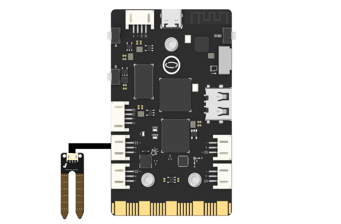

## **Project Introduction**
In this section, we simulate a plant humidity monitor through an external humidity sensor and GUI interface.
UNIHIKER is equipped with a microcontroller responsible for controlling onboard components and GPIO. Based on this functionality, we can control the external humidity sensor by Pin21.   

This project uses the ADC method in the PinPong library of Python to control the humidity sensor externally connected through side pins of the board. The reason for using humidity sensor is that the humidity sensor transfers parameters by reading analog signals, and UNIHIKER processes the data.
Here is an example of simulating a plant humidity monitor by moisture sensor. 
![5-480P[00h00m00s-00h00m06s].gif](img/5_Plant_Moisture_Monitoring/1721282244324-ebb72198-b2f7-4a84-9c99-58dd2f46570c.gif)
## **Hardware Required**

- [UNIHIKER](https://www.dfrobot.com/product-2691.html)
- [Gravity: Analog Soil Moisture Sensor for Arduino](https://www.dfrobot.com/product-599.html)

{width=400, style="display:block;margin: 0 auto"}
### **GUI components**
We use the following image to simulate and beautify the GUI interface.
  

We can add this image to the project folder,The file is named as "plant.png", just like the operation in the basic example. 

>Note: The image size is 320x240, and the length unit is px.

## **Code**
In this example:  

- The UNIHIKER is first initialized with Board().begin(). 
- Use adc21 = ADC(Pin(Pin.P21)) to initialize the pin. Additionally, we use gui=GUI() to initialize the GUI and use txt=gui.draw_text() to display the desired content on the screen. 
- In the main loop, we use the value.config(text = adc21.read()) method to change the displayed value of humidity.
```python
# -*- coding: utf-8 -*-
# Experimental effect: Simulate a plant humidity monitor through an external humidity sensor and GUI interface
# Wiring: Use a computer to connect a UNIHIKER, Pin21 connects the humidity sensor
import time
from pinpong.board import Board,Pin,ADC  # Import ADC class to implement analog input
from pinpong.extension.unihiker import *
from unihiker import GUI  # Import unihiker library

Board("UNIHIKER").begin()  # Initialize, select board type, do not input board type for automatic recognition

# Analog pin P0 P1 P2 P3 P4 P10 P21 P22
gui=GUI()

img = gui.draw_image(x=0,y=0,w=240, h=320, image='plant.png')  # Display initial background image as car1
txt=gui.draw_text(text="Plant Moisture Monitoring",x=120,y=50,font_size=12,origin="center",color="#0000FF")
txt=gui.draw_text(text="soil moisture:",x=80,y=140,font_size=12,origin="center",color="#0000FF")
value = gui.draw_text(x=150, y=125, text='0', font_size=15)  # Display initial distance value

adc21 = ADC(Pin(Pin.P21))

while True:
  val = adc21.read()
  print("P21=",val)
  value.config(text = val)  # Update display distance value
  time.sleep(0.5)
```
## **Demo Effect**
![5-480P[00h00m00s-00h00m06s].gif](img/5_Plant_Moisture_Monitoring/1721282244324-ebb72198-b2f7-4a84-9c99-58dd2f46570c.gif)


---
