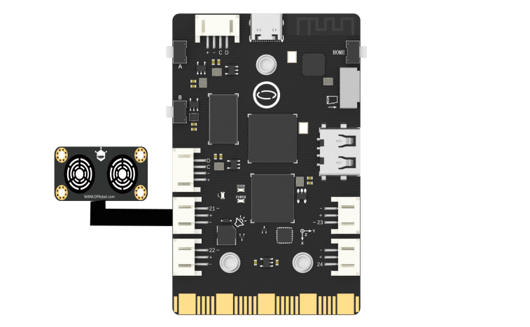
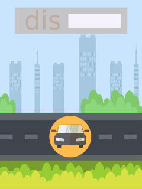
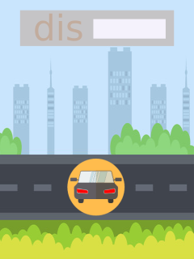

## **Project Introduction**
In this section, we simulate Ultrasonic Range Finder through an external ultrasonic range finder and GUI interface.
UNIHIKER is equipped with a microcontroller responsible for controlling onboard components and GPIO.   

Based on this functionality, we can control the external ultrasonic sensor by Pin21. This project uses the ANALOG_URM09 method in the PinPong library of Python to control the ultrasonic sensor externally connected through side pins of the board. The reason for using the ultrasonic module is that it can detect the distance between the object in front of itself through ultrasonic waves, thereby simulating the scene of obstacles and timely braking when the vehicle is moving forward.    

Here is an example of simulating a Vehicle distance detector by ultrasonic range sensor. 
![6-480P[00h00m00s-00h00m07s].gif](img/6_Ultrasonic_Range_Finder/1721282299424-a193df2c-ecbd-42c9-802b-350d334d2898.gif)


## **Hardware Required**

- [UNIHIKER](https://www.dfrobot.com/product-2691.html)
- [Gravity: URM09 Ultrasonic Distance Sensor (2～500cm, Analog)](https://www.dfrobot.com/product-1862.html)

{width=400, style="display:block;margin: 0 auto"}
### **GUI components**
We use the following image to simulate and beautify the GUI interface.
  

We can add these two images to the project folder, The file is named as car1.png,just like the operation in the basic example.
> Note: The image size is 320x240, and the length unit is px.

## **Code**
In this example:

- UNIHIKER is first initialized with Board().begin(). 
- Use gui=GUI() to initialize the  GUI. 
- Use urm091 = ANALOG_URM09(Pin((Pin.P21))) to initialize the pin. We use txt=gui.draw_text() to display the content we want to display on the screen. 
- In the main loop, we use the dis = urm091.distance_cm() method to get the value of the distance. 
- We used a check statement to determine whether the distance was enough to brake, in order to complete the image switching.
```python
#  -*- coding: UTF-8 -*-

# Experimental effect: Simulate a Vehicle distance monitor through an external ultrasonic sensor and GUI interface
# Wiring: Use a computer to connect a UNIHIKER, Pin21 connects the ultrasonic sensor
from pinpong.libs.dfrobot_analog_urm09 import ANALOG_URM09
from pinpong.extension.unihiker import *
from unihiker import GUI  # Import unihiker library
from pinpong.board import Board,Pin
import time


Board().begin()
gui = GUI()  # Instantiate GUI classes and create GUI objects

urm091 = ANALOG_URM09(Pin((Pin.P21)))
img = gui.draw_image(x=0,y=0,w=240, h=320, image='car1.png')  # Display initial background image as car1
value = gui.draw_text(x=150, y=18, text='0', font_size=18)  # Display initial distance value

while True:
    dis = urm091.distance_cm()
    value.config(text = dis)  # Update display distance value
    if 0 <= dis <= 10 :
        img.config(image='car2.png')  # Switch background image to car2
    elif dis > 10:
        img.config(image='car1.png')
    time.sleep(0.5)  # Delay for 0.5 second
```
## **Demo Effect**
![6-480P[00h00m00s-00h00m07s].gif](img/6_Ultrasonic_Range_Finder/1721282299424-a193df2c-ecbd-42c9-802b-350d334d2898.gif)


---
