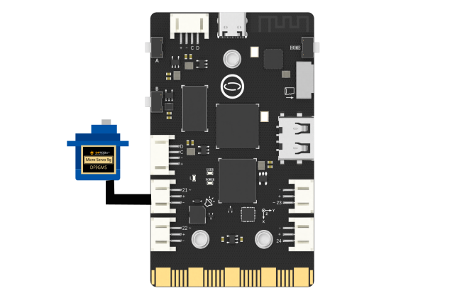

## **Project Introduction**
In this section, we use UNIHIKER to control an external servo for different types of rotation.
UNIHIKER is equipped with a microcontroller responsible for controlling onboard components and GPIO. Based on this functionality, we can control the external servo by Pin21.   

This project uses the s1 = Servo(Pin(Pin.P21)) method in the PinPong library of Python to control the servo externally connected through side pins of the board. We control the output level to drive the rotation of the servo by clicking the virtual button on UNIHIKER.
Here is an example of using UNIHIKER for servo drive. 
![7-480P[00h00m00s-00h00m09s].gif](img/7_Servo_Motor_Control/1721282400646-f2a0a9fc-93d4-439b-9b88-5a1d26b0de8a.gif)


!!! note
    The UNIHIKER is equipped with a ph2.0 pitch interface. If your servo motor uses a 2.54mm pitch head, you can use [this cable](https://www.dfrobot.com/product-2551.html) for conversion.
    The interface on the UNIHIKER can only connect to one 9g mini servo motor. Do not connect it to a standard servo motor or a metal servo motor to avoid destroying the UNIHIKER due to excessive power fluctuations.

## **Hardware Required**

- [UNIHIKER](https://www.dfrobot.com/product-2691.html)
- [9g 180° Clutch Servo](https://www.dfrobot.com/product-2120.html)

{width=400, style="display:block;margin: 0 auto"}
## **Code**
In this example:

- UNIHIKER is first initialized with Board().begin(). 
- Use gui=GUI() to initialize the  GUI. Then, we use s1 = Servo(Pin(Pin.P21)) to initialize the pin. 
- Use txt=gui.draw_text() to display the content we want to display on the screen.   
- In order to achieve virtual buttons on the screen, we defined four callback functions to control the output value of the servo rotation function. We use the botton_A = gui.add_button() method to set button properties. In order to maintain the long-term retention of the GUI interface, we have set a time delay function in the main function.
```python
# -*- coding: utf-8 -*-

# Experimental effect: Servo control
# Wiring: Use a computer to connect a UNIHIKER and P10 to connect a servo motor
import time
from pinpong.board import Board,Pin,Servo
from unihiker import GUI   
import time

Board("UNIHIKER").begin()  # Initialize, select board type, do not input board type for automatic recognition
gui=GUI() 
s1 = Servo(Pin(Pin.P21))  # Input Pin into Servo to initialize servo pins, supporting P0 P2 P3 P8 P9 P10 P16 P21 P22 P23

def click_A():  # Define the action when clicking button A
    s1.angle(10)  # Control the servo to turn to the 0 degree position
    print("10")
    time.sleep(1)

def click_B():  # Define the action when clicking button B
    s1.angle(90)  # Control the servo to turn to the 90 degree position
    print("90")
    time.sleep(1)

def click_C():  # Define the action when clicking button C
    s1.angle(170)  # Control the servo to turn to the 170 degree position
    print("170")
    time.sleep(1)

def click_D():  # Define the action when clicking button C
    for i in range(10, 171, 10):
        s1.angle(i)
        time.sleep(0.5)
    for i in range(171, 10, -10):
        s1.angle(i)
        time.sleep(0.5)  # Control the servo to turn to the 0-170 degree position
    print("circulate")
    time.sleep(1)

txt=gui.draw_text(text="servo",x=120,y=10,font_size=20,origin="center",color="#0000FF")
botton_A = gui.add_button(x=120, y=100, w=100, h=30, text="10°", origin='center', onclick=click_A)
botton_B = gui.add_button(x=120, y=150, w=100, h=30, text="90°", origin='center', onclick=click_B)
botton_C = gui.add_button(x=120, y=200, w=100, h=30, text="170°", origin='center', onclick=click_C)
botton_D = gui.add_button(x=120, y=250, w=100, h=30, text="circulate", origin='center', onclick=click_D)

while True:
   time.sleep(1)
```
## **Demo Effect**
![7-480P[00h00m00s-00h00m09s].gif](img/7_Servo_Motor_Control/1721282400646-f2a0a9fc-93d4-439b-9b88-5a1d26b0de8a.gif)


---
