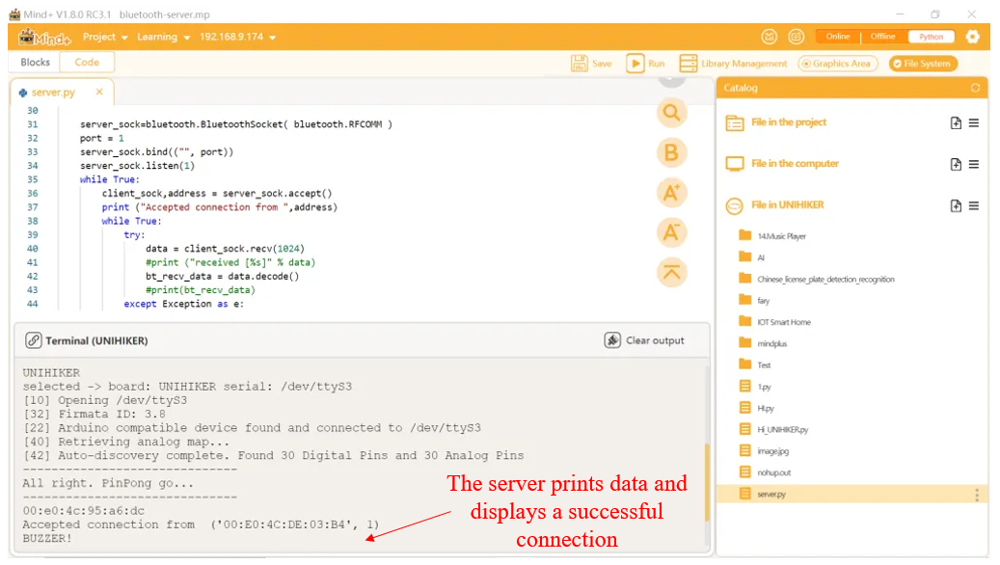

## **Project Introduction**

The UNIHIKER is equipped with Bluetooth functionality, thus it can perform Bluetooth communication. In this case, the bluetooth library is used to implement bidirectional Bluetooth socket communication between two UNIHIKERs.

In this project, we use two UNIHIKERs, one as a server and the other as a client. The client sends data to the server, and when the server receives the data, the buzzer makes a sound.

## **Hardware Required**

- [UNIHIKER](https://www.dfrobot.com/product-2691.html) × 2

### **Code**
The first paragraph is the server program,the local Bluetooth MAC address will be printed after startup,which receives data from the smart terminal and controls the buzzer to play music after running.

```python
#  -*- coding: UTF-8 -*-

import time
from pinpong.board import Board,Pin
from pinpong.extension.unihiker import *
import bluetooth
import threading
import os

bt_recv_data=''

#Clear the cache after reading the data once.
def getData():  # Obtain client data
    global bt_recv_data
    data = bt_recv_data
    bt_recv_data=''
    return data

def server_loop():  # Terminal detection loop to check if it is connected to the smart terminal
    global bt_recv_data
    os.system("sudo hciconfig hci0 piscan")  #enable bluetooth
    os.system("cat /opt/bdaddr")  #show the bluetooth mac address
    time.sleep(1)
    server_sock=bluetooth.BluetoothSocket( bluetooth.RFCOMM )  # Server interface functions
    port = 1
    server_sock.bind(("", port))  # port
    server_sock.listen(1)  # The number of queued sockets
    while True:
        client_sock,address = server_sock.accept()  # Obtain the address of the smart terminal
        print ("Accepted connection from ",address)
        while True:
            try:
                data = client_sock.recv(1024)  # Obtained client data
                #print ("received [%s]" % data)
                bt_recv_data = data.decode()  # Decoding data
                #print(bt_recv_data)
            except Exception as e:
                print(e)
                break

        client_sock.close()  # Close the interface
    server_sock.close()  # Close the interface

threading.Thread(target=server_loop).start()  # Start thread

Board().begin()

while True:
    if (len(bt_recv_data)>0):  # Determine whether data from the smart terminal has been received
        bt_data = getData()
        print(bt_data)
        if (bt_data == 'BUZZER!'):  # If the data is set by the smart terminal
            buzzer.play(buzzer.DADADADUM,buzzer.Once)  # Buzzer beeps
    time.sleep(1)
```

## **Demo Effect:**


The second part is the client program, you need to modify the MAC address in the program to the MAC address printed by the server. After the program runs, it will send data to the server.

```python
#  -*- coding: UTF-8 -*-
import bluetooth

server_mac = "00:e0:4c:95:a6:dc"

print(server_mac,",connecting...")  # Print the address of the smart terminal
client_sock=bluetooth.BluetoothSocket(bluetooth.RFCOMM )  # Bluetooth interface of smart terminal
client_sock.connect((server_mac, 1))  # Function for determining Bluetooth connection
print(server_mac,",connected!")  # Print connection successful

client_sock.send("BUZZER!")  # Sending data to the server
print("done")

```
## **Demo Effect**


After the smart terminal is connected, the buzzer on the server will sound and display the successful connection and data on the terminal.


