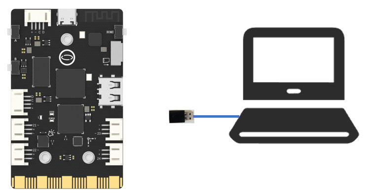
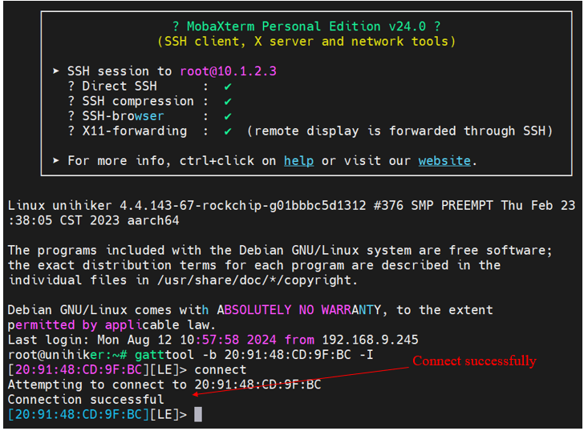
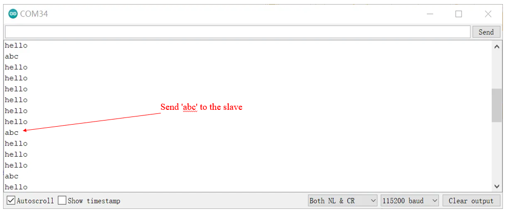
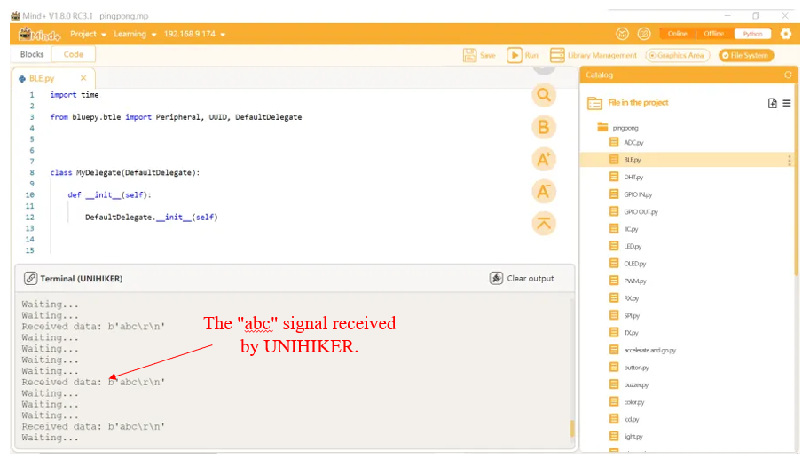

## **Project Introduction**
The Bluetooth functionality on the UNIHIKER also supports BLE (Bluetooth Low Energy) communication, we can also use the Bluepy.btle library for Bluetooth communication.  

BLE-Link is a device produced by DFRobot that can convert BLE communication to UART. It comes in a form suitable for plugging into Arduino, enabling Arduino to have BLE communication capabilities and receive and send data via UART. Another form is converted into a USB serial device, which can convert BLE devices into USB serial signals. For the sake of demonstration convenience, this article uses the BLE-Link Dongle.  


The following code is suitable for communication scenarios where the slave Bluetooth module and UNIHIKER can be successfully connected. Firstly, UNIHIKER sends a "hello" signal to the slave module after running the program, waiting for the Bluetooth slave module to send a signal. At the same time, we use the serial monitoring assistant on Windows to send a signal to UNIHIKER, which can be seen on mind+.

Through this case, other BLE devices can also refer to this idea and code for communication.

## **Hardware Required**

- [UNIHIKER](https://www.dfrobot.com/product-2691.html) 
- [Bluno Link - A USB Bluetooth 4.0 (BLE) Dongle](https://www.dfrobot.com/product-1220.html)




## **Code**

According to the BLE-Link information, obtain the Bluetooth MAC address of the device and set it to the default slave mode.

> Tips: How to initialize the BLE module? For more information, please refer to: [DFRobot wiki](https://wiki.dfrobot.com/USBBLE-LINK_Bluno_Wireless_Programming_Adapter_SKU__TEL0087)   
> The following command can be used in the terminal to test if the BLE device can be connected.   
> {width=400, style="display:block;margin: 0 auto"}

```python
import time
from bluepy.btle import Peripheral, UUID, DefaultDelegate

mac_address = "20:91:48:CD:9F:BC"
service_uuid = "0000dfb0-0000-1000-8000-00805f9b34fb"
characteristics_uuid = "0000dfb1-0000-1000-8000-00805f9b34fb"

class MyDelegate(DefaultDelegate):
    def __init__(self):
        DefaultDelegate.__init__(self)
    def handleNotification(self, cHandle, data):
        print('Received data:', data)
p = Peripheral(mac_address, "public")

try:

    p.setDelegate(MyDelegate())

    svc = p.getServiceByUUID(UUID(service_uuid))

    char = svc.getCharacteristics(UUID(characteristics_uuid))[0]

    while True:
        char.write(bytes("hello\n", 'utf-8'))
        time.sleep(0.2)
        if p.waitForNotifications(0.1):  # handleNotification() was called
            continue
        print("Waiting...")

finally:
    p.disconnect()
```

## **Demo Effect**
  



---
